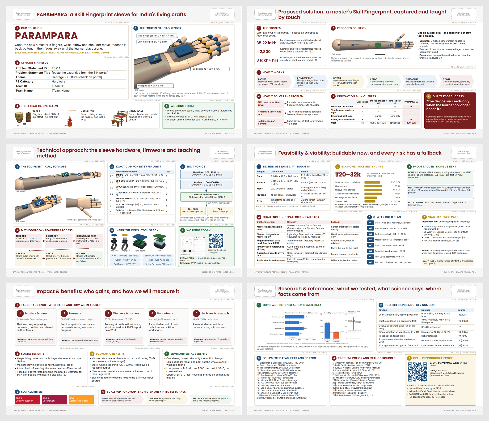
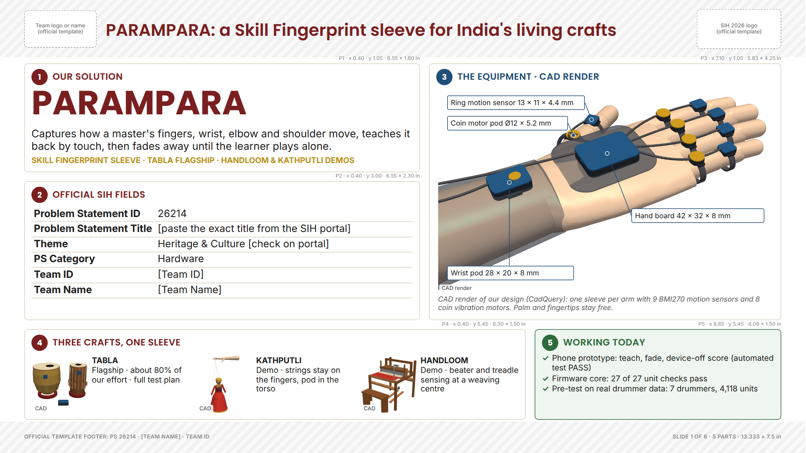
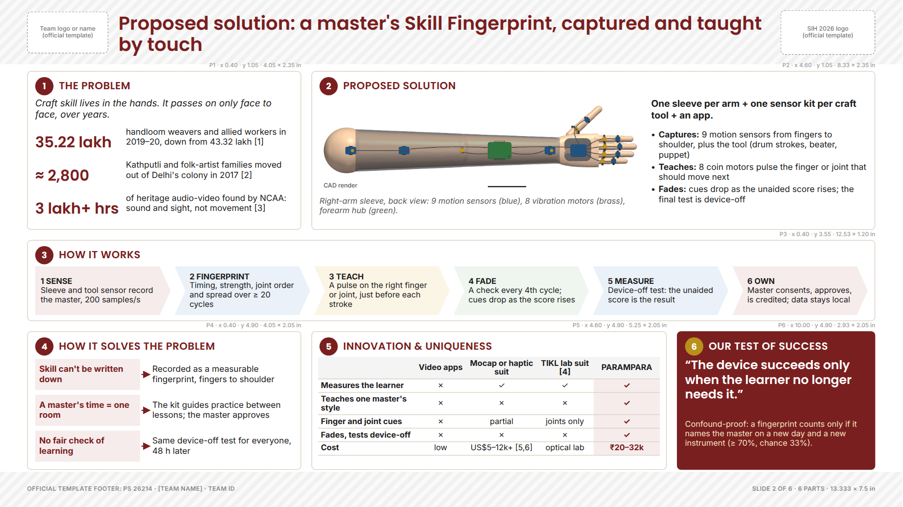
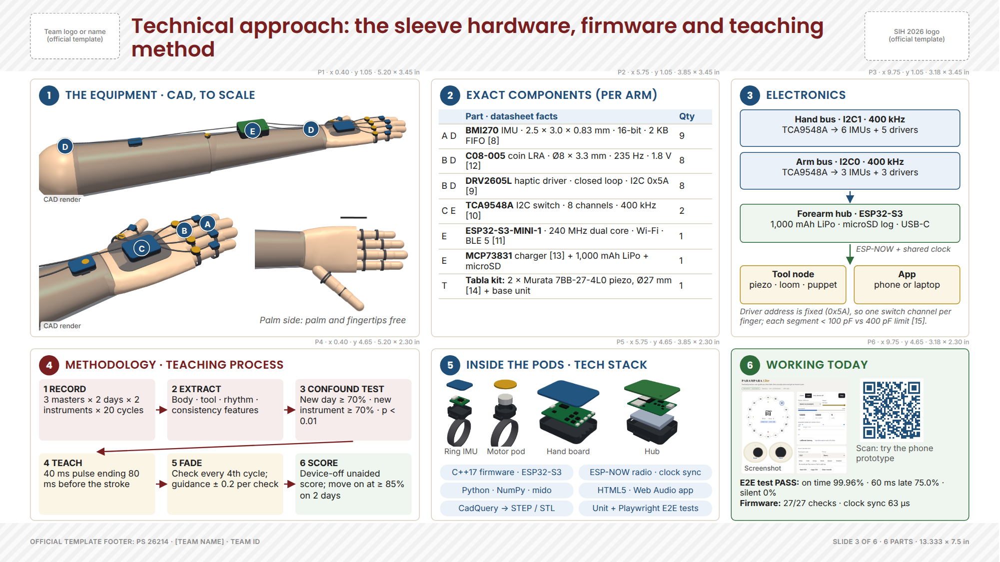
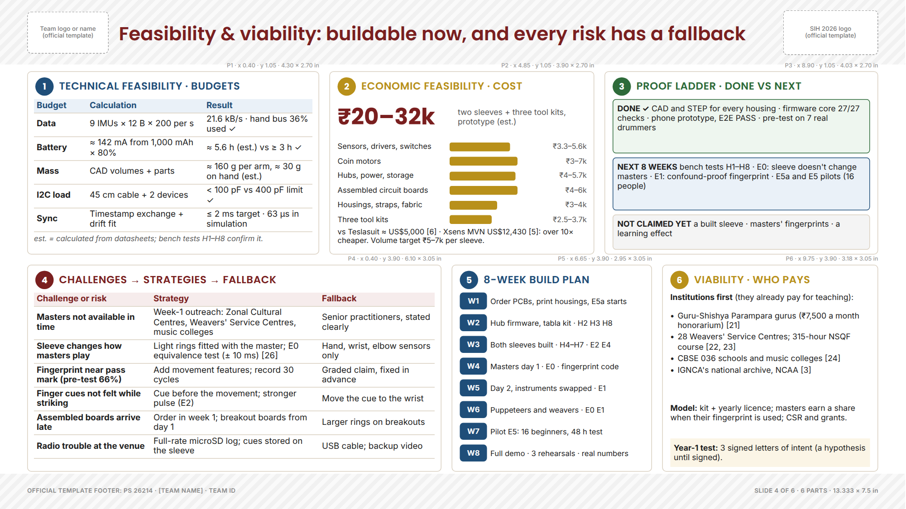
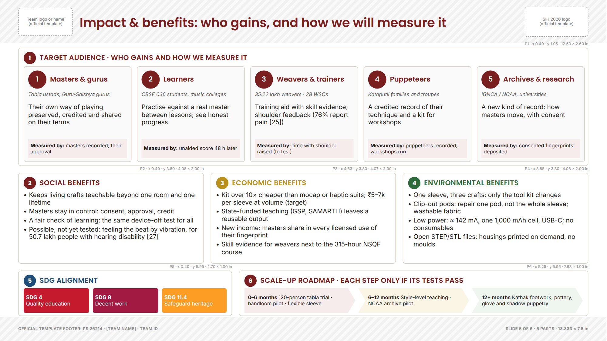
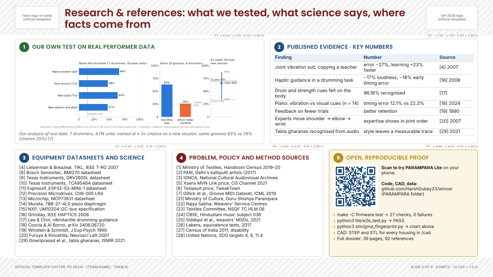

# PARAMPARA · SIH 2026 PS 26214 · Master prompts and helper for the 6-slide hardware PPT

This file gives you, for each of the six official slides: how many parts the slide has and exactly where each part goes, the exact words for every part, a picture of the layout (wireframe), one copy-paste prompt that builds the slide, and the GPT image prompts for that slide. Everything comes from one source (`ppt/helper/spec.py`), so the wireframes, the positions and the prompts always match. Every text box was checked in the real fonts (Poppins and Inter): nothing overflows at the sizes given.

## 0. Read this first

**About winner decks.** National-winner idea PPTs are not published officially, and the decks circulating on GitHub and Telegram as 'SIH winner PPTs' cannot be verified, so this layout does not copy any of them. It follows two things that are verifiable: the official SIH idea template (6 slides, PDF, the fixed questions on each slide) and the way hardware teams present at international design reviews (product render, exploded view, block diagram, parts list with datasheet numbers, engineering budgets, test plan, risk register, and an honest done/next/not-yet line).

**How the slides are split.** Every slide has 5 or 6 numbered parts (the number badge is part of the design). Each part answers one question the template asks, so a judge can tick off the template while reading. The table *Template question → where it is answered* on each slide proves nothing is missing.

**How to use this (pick one):**

1. **ChatGPT (fastest):** open a new chat, upload the images listed in the slide's prompt (all are in `helper/PARAMPARA_slide_assets.zip`), paste the slide's master prompt, and ask for a .pptx. Do one slide per chat. Then paste all six slides into the official SIH template.
2. **Canva or Google Slides:** set a custom size of 13.333 × 7.5 in, keep the wireframe image open beside you, and place each part at the x, y, w, h given in the part table. Copy the text from *Exact content*.
3. **PowerPoint by hand:** same as 2; use *Shape Format → Size and Position* to type the exact numbers.

**Honesty rules (keep them, they protect you in the evaluation):** CAD renders are labelled 'CAD render'. AI images are labelled 'Concept illustration (AI)'. Say 'eight defined bench tests', 'pre-test on real performers', 'phone prototype working'. Never write 'validated end to end', 'proven fingerprint' or 'improves learning'. Master A and B in PARAMPARA Lite are example profiles.

**Fill before export:** the exact PS title from the portal, the theme (check it on the portal), your Team ID and Team Name. Make the QR on slides 3 and 6 point to a public link (host `PARAMPARA/lite/index.html` on GitHub Pages, then regenerate the QR).

## 1. Global design system



| Item | Value |
|---|---|
| Canvas | 16:9, 13.333 × 7.5 in (PowerPoint 'Widescreen'), white background |
| Template zones | Header y 0 to 0.95 in (team logo left, SIH logo right, slide title between); footer y 6.98 to 7.5 in. Our parts live in x 0.40 to 12.93, y 1.05 to 6.95 |
| Slide title | x 1.75, y 0.13, 9.60 × 0.74 in; Poppins SemiBold 20 pt; #7A1F1F; 1 or 2 lines |
| Panel | White, 1 pt #D9CFC0 border, corner radius 0.06 in, no shadow; 0.15 in gap between panels |
| Panel header | 0.27 in number badge (panel colour, white Poppins Bold 10 pt) + UPPERCASE Poppins SemiBold 11 pt title in the panel colour; content starts 0.42 in below the panel top |
| Fonts | Poppins (titles, big numbers), Inter (all other text). Fallback: Calibri for both |
| Sizes | Big numbers 16 to 40 pt; body 8.5 to 10 pt; tables 8.5 pt; captions and tags 7.5 to 8.5 pt. Nothing below 7.5 pt |
| Images | Transparent PNGs, aspect ratio kept, never cropped; each CAD image tagged 'CAD render' |
| Motif | Numbered panel badges + colour per meaning (no side bars, no gradients, no clip art) |

| Colour | Hex | Use it for |
|---|---|---|
| Maroon | `#7A1F1F` | Idea, problem, risks, slide titles, the product name |
| Indigo blue | `#1F4E79` | Everything technical: hardware, electronics, budgets, datasheets |
| Brass | `#B8901A` | Money and value: cost, viability, economic benefit; badge on dark panels |
| Green | `#2E6B3A` | Proof that already works: 'Working today', done items, environmental benefit |
| Text | `#1E1E1E` | All body text |
| Muted grey | `#5A5A5A` | Captions, image tags, units |
| Panel border | `#D9CFC0` | 1 pt border of every white panel |
| Maroon tint | `#F6ECEC` | Highlight column of the comparison table, gap labels |
| Blue tint | `#EAF1F8` | Technical boxes in diagrams, 'next' band |
| Brass tint | `#FBF5E6` | Cost and viability highlights, tool-node boxes |
| Green tint | `#EEF6EF` | 'Working today' panels, 'done' band |
| Neutral tint | `#F4F4F4` | Craft tiles, 'not claimed yet' band |

## 2. Images used, and where

All files are in `PARAMPARA/ppt/assets/` and `PARAMPARA/figures/`, and together in `PARAMPARA/ppt/helper/PARAMPARA_slide_assets.zip`. These are our own CAD renders, charts and screenshots, not AI images.

| File | What it shows | Slide · part | Tag to print |
|---|---|---|---|
| `hand_iso_transparent.png` | Hand end of the sleeve, 3/4 view (CAD) | 1·3, 3·1 | CAD render |
| `tabla_iso_transparent.png` | Tabla kit: piezo clips + base unit (CAD) | 1·4 | CAD |
| `puppet_iso_transparent.png` | Kathputli kit: pod in the torso (CAD) | 1·4 | CAD |
| `loom_iso_transparent.png` | Handloom kit: beater IMU, treadle switches (CAD) | 1·4 | CAD |
| `sleeve_dorsal_transparent.png` | Whole sleeve, back view (CAD) | 2·2 | CAD render |
| `sleeve_iso_transparent.png` | Whole right-arm sleeve, 3/4 view (CAD) | 3·1 | CAD render |
| `hand_palmar_transparent.png` | Palm side: palm and fingertips free (CAD) | 3·1 | (none) |
| `ring_exploded_transparent.png` | Finger ring IMU pod, exploded (CAD) | 3·5 | (none) |
| `motor_exploded_transparent.png` | Finger motor pod, exploded (CAD) | 3·5 | (none) |
| `hand_exploded_transparent.png` | Hand board, exploded (CAD) | 3·5 | (none) |
| `hub_exploded_transparent.png` | Forearm hub, exploded (CAD) | 3·5 | (none) |
| `v6_lite_screenshot.png` | PARAMPARA Lite running (real screenshot) | 3·6 | Screenshot |
| `qr_parampara_lite.png` | QR to the phone prototype | 3·6, 6·5 | (none) |
| `v5_gmd_results.png` | Our pre-test on real drummer data (chart) | 6·1 | (none) |

## Slide 1 · Title  (5 parts)

**The template asks:** Problem Statement ID; Problem Statement Title; Theme; PS Category; Team ID; Team Name.

**What a judge must take away in 5 seconds:** PARAMPARA is a wearable for India's living crafts, entered as hardware for PS 26214, and it already has working proof.

**Reading order:** Z-pattern: name (top-left), then the official fields, then the hero render (right), then the craft strip and proof (bottom).



### Template question → where it is answered

| Template question | Answered in |
|---|---|
| Problem Statement ID, Title, Theme, PS Category, Team ID, Team Name | Part 2 (exact fields table) |
| (not asked, but judges decide in 5 seconds) What is it? | Part 1 (name + one-line definition) |
| (not asked) Is it real hardware? | Part 3 (hero CAD render with dimensions) |
| (not asked) Scope | Part 4 (three crafts, tabla flagship) |
| (not asked) Any proof yet? | Part 5 (working today) |

### The parts: position and purpose

| Part | Name | x, y (in) | w × h (in) | Colour | What goes here and why |
|---|---|---|---|---|---|
| 1 | Our solution | 0.40, 1.05 | 6.55 × 1.80 | `#7A1F1F` | The product name, big, and one sentence that says what it does. A judge who reads only this knows the idea. |
| 2 | Official SIH fields | 0.40, 3.00 | 6.55 × 2.30 | `#7A1F1F` | Exactly the fields the template asks for, in the same order, copied character by character from the portal. |
| 3 | The equipment · CAD render | 7.10, 1.05 | 5.83 × 4.25 | `#1F4E79` | The hero image: our own CAD render of the hand end of the sleeve, with four dimension call-outs. Labelled 'CAD render' so no judge mistakes it for a photo. |
| 4 | Three crafts, one sleeve | 0.40, 5.45 | 8.30 × 1.50 | `#7A1F1F` | Three small CAD renders of the tool kits so the judge sees one sleeve generalises, and that tabla is the focus. |
| 5 | Working today | 8.85, 5.45 | 4.08 × 1.50 | `#2E6B3A` | Three facts that are true today and checkable in the repository. Green = already working. |

### Exact content (copy-ready)

**Slide title:** PARAMPARA: a Skill Fingerprint sleeve for India's living crafts

**Part 1 · Our solution**

- PARAMPARA
- Captures how a master's fingers, wrist, elbow and shoulder move, teaches it back by touch, then fades away until the learner plays alone.
- SKILL FINGERPRINT SLEEVE  ·  TABLA FLAGSHIP  ·  HANDLOOM & KATHPUTLI DEMOS

**Part 2 · Official SIH fields**


| Problem Statement ID | 26214 |
|---|---|
| Problem Statement Title | [paste the exact title from the SIH portal] |
| Theme | Heritage & Culture  [check on portal] |
| PS Category | Hardware |
| Team ID | [Team ID] |
| Team Name | [Team Name] |


**Part 3 · The equipment · CAD render**

- Image: `hand_iso_transparent.png` (tag: "CAD render")
- Call-out label: Ring motion sensor 13 × 11 × 4.4 mm
- Call-out label: Coin motor pod Ø12 × 5.2 mm
- Call-out label: Hand board 42 × 32 × 8 mm
- Call-out label: Wrist pod 28 × 20 × 8 mm
- CAD render of our design (CadQuery): one sleeve per arm with 9 BMI270 motion sensors and 8 coin vibration motors. Palm and fingertips stay free.

**Part 4 · Three crafts, one sleeve**

- Image: `tabla_iso_transparent.png` (tag: "CAD")
- **TABLA** | Flagship · about 80% of our effort · full test plan
- Image: `puppet_iso_transparent.png` (tag: "CAD")
- **KATHPUTLI** | Demo · strings stay on the fingers, pod in the torso
- Image: `loom_iso_transparent.png` (tag: "CAD")
- **HANDLOOM** | Demo · beater and treadle sensing at a weaving centre

**Part 5 · Working today**

- ✓ Phone prototype: teach, fade, device-off score (automated test PASS)
- ✓ Firmware core: 27 of 27 unit checks pass
- ✓ Pre-test on real drummer data: 7 drummers, 4,118 units

### Master prompt for this slide

Paste this whole block into ChatGPT (after uploading the images it names), or follow it by hand in Canva or PowerPoint.

```text
You are a senior presentation designer who builds hardware design-review slides. Build slide 1 of 6 of an SIH 2026 idea-submission deck (problem statement 26214, PARAMPARA). Make exactly ONE slide. Output a .pptx file (python-pptx) or, in Canva or Gamma, place everything by hand at the positions below.
UPLOAD THESE IMAGES FIRST: hand_iso_transparent.png, tabla_iso_transparent.png, puppet_iso_transparent.png, loom_iso_transparent.png (from the PARAMPARA slide asset pack).

GLOBAL STYLE (same on all six slides)
- Canvas: 16:9, 13.333 × 7.5 in, white background (#FFFFFF). All positions are in inches from the top-left corner.
- Keep the official SIH 2026 template header (y 0 to 0.95 in: team logo/name left, SIH logo right) and footer (y 6.98 to 7.5 in) exactly as the template has them. Put nothing of ours there except the slide title.
- Slide title: text box x 1.75, y 0.13, 9.60 × 0.74 in, Poppins SemiBold 20 pt, #7A1F1F, left-aligned, vertically centred, at most 2 lines.
- Panels ("parts"): white fill, 1 pt #D9CFC0 border, corner radius 0.06 in, no shadow. Gap between panels 0.15 in.
- Panel header: a 0.27 in circle badge at (panel x + 0.12, panel y + 0.09) with the part number in white Poppins Bold 10 pt, filled with the panel colour; header text at (panel x + 0.47, panel y + 0.07), height 0.32 in, Poppins SemiBold 11 pt, UPPERCASE, letter spacing 0.4 pt, in the panel colour. Panel content starts 0.42 in below the panel top.
- Fonts: Poppins (headings, big numbers) and Inter (everything else). If PowerPoint lacks them, install both from Google Fonts or use Calibri for both. Nothing smaller than 7.5 pt; body text 8.5 to 10 pt.
- Colours: maroon #7A1F1F (idea, problem, risks), blue #1F4E79 (technical), brass #B8901A (money, value), green #2E6B3A (proof that works today), text #1E1E1E, muted #5A5A5A. Tints: #F6ECEC, #EAF1F8, #FBF5E6, #EEF6EF, #F4F4F4.
- Images: transparent PNGs placed exactly as given, aspect ratio kept, never stretched or cropped. Every CAD image keeps a small "CAD render" tag; never present a render as a photograph.
- Text: use the words given, word for word. "**x**" means bold, " | " means a line break. Do not add sentences, numbers, emojis or clip art.
- Before finishing: no text overflows its box, nothing overlaps, every element sits inside its panel, all six (or five) parts are visible and evenly spaced.

SLIDE TITLE: "PARAMPARA: a Skill Fingerprint sleeve for India's living crafts"

LAYOUT: 5 parts. Reading order: Z-pattern: name (top-left), then the official fields, then the hero render (right), then the craft strip and proof (bottom).

PART 1: OUR SOLUTION  (answers: Identity (not a template field, but the first thing a judge reads))
  Panel: x 0.40, y 1.05, 6.55 × 1.80 in; fill #FFFFFF; 1 pt #D9CFC0 border; badge #7A1F1F; header text #7A1F1F.
  - Text at x 0.52, y 1.38, 6.30 × 0.74 in: "PARAMPARA" (Poppins Bold 40 pt, #7A1F1F).
  - Text at x 0.52, y 2.12, 6.30 × 0.46 in: "Captures how a master's fingers, wrist, elbow and shoulder move, teaches it back by touch, then fades away until the learner plays alone." (Inter 12.5 pt, #1E1E1E).
  - Text at x 0.52, y 2.59, 6.30 × 0.22 in: "SKILL FINGERPRINT SLEEVE  ·  TABLA FLAGSHIP  ·  HANDLOOM & KATHPUTLI DEMOS" (Inter Bold 9.5 pt, #B8901A).

PART 2: OFFICIAL SIH FIELDS  (answers: All six template fields: PS ID, PS Title, Theme, PS Category, Team ID, Team Name)
  Panel: x 0.40, y 3.00, 6.55 × 2.30 in; fill #FFFFFF; 1 pt #D9CFC0 border; badge #7A1F1F; header text #7A1F1F.
  - Table at x 0.52, y 3.42, width 6.31 in, max height 1.82 in; column widths 2.05, 4.26 in; Inter 12 pt; 0.75 pt #D9CFC0 line under every row, no vertical lines; cell margins 0.03 in top/bottom, 0.05 in left/right; no header row; first column bold. Rows:
      | Problem Statement ID | 26214 |
      | Problem Statement Title | [paste the exact title from the SIH portal] |
      | Theme | Heritage & Culture  [check on portal] |
      | PS Category | Hardware |
      | Team ID | [Team ID] |
      | Team Name | [Team Name] |

PART 3: THE EQUIPMENT · CAD RENDER  (answers: Shows it is real hardware with real dimensions)
  Panel: x 7.10, y 1.05, 5.83 × 4.25 in; fill #FFFFFF; 1 pt #D9CFC0 border; badge #1F4E79; header text #1F4E79.
  - Image `hand_iso_transparent.png` at x 7.25, y 1.50, fitted inside 5.53 × 3.36 in (keep aspect ratio, no crop); small tag "CAD render" on its bottom-left corner (Inter 7.5 pt #5A5A5A on white at 85%).
  - Label "Ring motion sensor 13 × 11 × 4.4 mm" at x 7.40, y 1.58, 2.28 × 0.24 in (white box, 1 pt #1F4E79 border, Inter 8.5 pt #1E1E1E, vertically centred) with a 0.75 pt #1F4E79 line to a 0.06 in #1F4E79 dot at (9.79, 1.98) in, on that part of the render.
  - Label "Coin motor pod Ø12 × 5.2 mm" at x 7.40, y 1.92, 2.00 × 0.24 in (white box, 1 pt #1F4E79 border, Inter 8.5 pt #1E1E1E, vertically centred) with a 0.75 pt #1F4E79 line to a 0.06 in #1F4E79 dot at (9.49, 2.24) in, on that part of the render.
  - Label "Hand board 42 × 32 × 8 mm" at x 10.45, y 3.45, 2.20 × 0.24 in (white box, 1 pt #1F4E79 border, Inter 8.5 pt #1E1E1E, vertically centred) with a 0.75 pt #1F4E79 line to a 0.06 in #1F4E79 dot at (10.05, 2.54) in, on that part of the render.
  - Label "Wrist pod 28 × 20 × 8 mm" at x 7.40, y 4.40, 2.10 × 0.24 in (white box, 1 pt #1F4E79 border, Inter 8.5 pt #1E1E1E, vertically centred) with a 0.75 pt #1F4E79 line to a 0.06 in #1F4E79 dot at (8.43, 3.02) in, on that part of the render.
  - Text at x 7.25, y 4.88, 5.53 × 0.36 in: "CAD render of our design (CadQuery): one sleeve per arm with 9 BMI270 motion sensors and 8 coin vibration motors. Palm and fingertips stay free." (Inter 8.5 pt, #5A5A5A, italic).

PART 4: THREE CRAFTS, ONE SLEEVE  (answers: Scope: which crafts, and which one is the flagship)
  Panel: x 0.40, y 5.45, 8.30 × 1.50 in; fill #FFFFFF; 1 pt #D9CFC0 border; badge #7A1F1F; header text #7A1F1F.
  - Image `tabla_iso_transparent.png` at x 0.52, y 5.87, fitted inside 0.95 × 0.98 in (keep aspect ratio, no crop); small tag "CAD" on its bottom-left corner (Inter 7.5 pt #5A5A5A on white at 85%).
  - Text at x 1.52, y 5.90, 1.62 × 0.95 in: "**TABLA** | Flagship · about 80% of our effort · full test plan" (Inter 9.5 pt, #1E1E1E).
  - Image `puppet_iso_transparent.png` at x 3.24, y 5.87, fitted inside 0.95 × 0.98 in (keep aspect ratio, no crop); small tag "CAD" on its bottom-left corner (Inter 7.5 pt #5A5A5A on white at 85%).
  - Text at x 4.24, y 5.90, 1.62 × 0.95 in: "**KATHPUTLI** | Demo · strings stay on the fingers, pod in the torso" (Inter 9.5 pt, #1E1E1E).
  - Image `loom_iso_transparent.png` at x 5.96, y 5.87, fitted inside 0.95 × 0.98 in (keep aspect ratio, no crop); small tag "CAD" on its bottom-left corner (Inter 7.5 pt #5A5A5A on white at 85%).
  - Text at x 6.96, y 5.90, 1.62 × 0.95 in: "**HANDLOOM** | Demo · beater and treadle sensing at a weaving centre" (Inter 9.5 pt, #1E1E1E).

PART 5: WORKING TODAY  (answers: Proof (sets this team apart on slide 1))
  Panel: x 8.85, y 5.45, 4.08 × 1.50 in; fill #EEF6EF; 1 pt #2E6B3A border; badge #2E6B3A; header text #2E6B3A.
  - Bullet list at x 8.97, y 5.86, 3.84 × 1.04 in, Inter 9.5 pt #1E1E1E, bullet character "✓" in #2E6B3A, 2 pt after each item: (1) "Phone prototype: teach, fade, device-off score (automated test PASS)" (2) "Firmware core: 27 of 27 unit checks pass" (3) "Pre-test on real drummer data: 7 drummers, 4,118 units".

DO NOT: Do not shrink the official fields; they are what the screening team checks first. Do not replace the CAD render with an AI picture of the device. Do not write 'proven' or 'validated' anywhere on this slide.
SPEAKER NOTES (put in the notes pane, not on the slide): We are Team [name], problem statement 26214, hardware. PARAMPARA is a sensor sleeve from the fingers to the shoulder. It records how a master moves, teaches it back by touch, and then steps away until the learner plays alone. Tabla is our flagship; Kathputli and handloom show the same sleeve generalises. Three things already work today: the phone prototype, the firmware core and a pre-test on real performer data.
```

### Images for this slide

Use our own files listed in the prompt. Optional AI images (prompts in section 9): IMG-1 (concept_tabla_sleeve.png), IMG-3 (concept_kathputli.png), IMG-4 (concept_handloom.png), IMG-5 (studio_ring_pod.png).

### Speaker notes (about 40 seconds)

We are Team [name], problem statement 26214, hardware. PARAMPARA is a sensor sleeve from the fingers to the shoulder. It records how a master moves, teaches it back by touch, and then steps away until the learner plays alone. Tabla is our flagship; Kathputli and handloom show the same sleeve generalises. Three things already work today: the phone prototype, the firmware core and a pre-test on real performer data.

### Don't

- Do not shrink the official fields; they are what the screening team checks first.
- Do not replace the CAD render with an AI picture of the device.
- Do not write 'proven' or 'validated' anywhere on this slide.

## Slide 2 · Idea  (6 parts)

**The template asks:** Detailed explanation of the proposed solution; How it addresses the problem; Innovation and uniqueness of the solution.

**What a judge must take away in 5 seconds:** Skill lives in the hands and is disappearing; PARAMPARA records it as a fingerprint, teaches it by touch, then fades, and nothing else does all of that.

**Reading order:** Row 1: problem → solution. Row 2: the 6-step flow across the full width. Row 3: why it solves the problem → how it differs → the one-line USP.



### Template question → where it is answered

| Template question | Answered in |
|---|---|
| Detailed explanation of the proposed solution | Part 2 (what it is) + Part 3 (how it works, 6 steps) |
| How it addresses the problem | Part 1 (the problem, with numbers) + Part 4 (gap → our answer) |
| Innovation and uniqueness | Part 5 (comparison table) + Part 6 (our test of success) |

### The parts: position and purpose

| Part | Name | x, y (in) | w × h (in) | Colour | What goes here and why |
|---|---|---|---|---|---|
| 1 | The problem | 0.40, 1.05 | 4.05 × 2.35 | `#7A1F1F` | One sentence of context and three numbers with sources. Numbers in maroon so the eye lands on them first. |
| 2 | Proposed solution | 4.60, 1.05 | 8.33 × 2.35 | `#7A1F1F` | The whole sleeve (CAD render) on the left so the judge sees the device; three verbs on the right say what it does. |
| 3 | How it works | 0.40, 3.55 | 12.53 × 1.20 | `#7A1F1F` | Six arrow shapes across the full width: the pipeline in one glance. Full width because it is the spine of the idea. |
| 4 | How it solves the problem | 0.40, 4.90 | 4.05 × 2.05 | `#7A1F1F` | Three gaps, each with an arrow to our answer. This is the sentence judges look for under 'how it addresses the problem'. |
| 5 | Innovation & uniqueness | 4.60, 4.90 | 5.25 × 2.05 | `#7A1F1F` | A ✓/✗ comparison against the three closest alternatives, with our column tinted maroon. Judges read uniqueness from tables faster than from sentences. |
| 6 | Our test of success | 10.00, 4.90 | 2.93 × 2.05 | `#7A1F1F` | The one sentence we want judges to repeat, on the only dark panel of the slide so it is remembered. |

### Exact content (copy-ready)

**Slide title:** Proposed solution: a master's Skill Fingerprint, captured and taught by touch

**Part 1 · The problem**

- Craft skill lives in the hands. It passes on only face to face, over years.
- 35.22 lakh
- handloom weavers and allied workers in 2019–20, down from 43.32 lakh [1]
- ≈ 2,800
- Kathputli and folk-artist families moved out of Delhi's colony in 2017 [2]
- 3 lakh+ hrs
- of heritage audio-video found by NCAA: sound and sight, not movement [3]

**Part 2 · Proposed solution**

- Image: `sleeve_dorsal_transparent.png` (tag: "CAD render")
- Right-arm sleeve, back view: 9 motion sensors (blue), 8 vibration motors (brass), forearm hub (green).
- **One sleeve per arm + one sensor kit per craft tool + an app.**
- • **Captures:** 9 motion sensors from fingers to shoulder, plus the tool (drum strokes, beater, puppet)
- • **Teaches:** 8 coin motors pulse the finger or joint that should move next
- • **Fades:** cues drop as the unaided score rises; the final test is device-off

**Part 3 · How it works**

- Arrow step: **1 SENSE** | Sleeve and tool sensor record the master, 200 samples/s
- Arrow step: **2 FINGERPRINT** | Timing, strength, joint order and spread over ≥ 20 cycles
- Arrow step: **3 TEACH** | A pulse on the right finger or joint, just before each stroke
- Arrow step: **4 FADE** | A check every 4th cycle; cues drop as the score rises
- Arrow step: **5 MEASURE** | Device-off test: the unaided score is the result
- Arrow step: **6 OWN** | Master consents, approves, is credited; data stays local

**Part 4 · How it solves the problem**

- Skill can't be written down
- Recorded as a measurable fingerprint, fingers to shoulder
- A master's time = one room
- The kit guides practice between lessons; the master approves
- No fair check of learning
- Same device-off test for everyone, 48 h later

**Part 5 · Innovation & uniqueness**


|   | Video apps | Mocap or haptic suit | TIKL lab suit [4] | PARAMPARA |
|---|---|---|---|---|
| Measures the learner | ✗ | ✓ | ✓ | ✓ |
| Teaches one master's style | ✗ | ✗ | ✗ | ✓ |
| Finger and joint cues | ✗ | partial | joints only | ✓ |
| Fades, tests device-off | ✗ | ✗ | ✗ | ✓ |
| Cost | low | US$5–12k+ [5,6] | optical lab | ₹20–32k |


**Part 6 · Our test of success**

- “The device succeeds only when the learner no longer needs it.”
- Confound-proof: a fingerprint counts only if it names the master on a new day and a new instrument (≥ 70%, chance 33%).

### Master prompt for this slide

Paste this whole block into ChatGPT (after uploading the images it names), or follow it by hand in Canva or PowerPoint.

```text
You are a senior presentation designer who builds hardware design-review slides. Build slide 2 of 6 of an SIH 2026 idea-submission deck (problem statement 26214, PARAMPARA). Make exactly ONE slide. Output a .pptx file (python-pptx) or, in Canva or Gamma, place everything by hand at the positions below.
UPLOAD THESE IMAGES FIRST: sleeve_dorsal_transparent.png (from the PARAMPARA slide asset pack).

GLOBAL STYLE (same on all six slides)
- Canvas: 16:9, 13.333 × 7.5 in, white background (#FFFFFF). All positions are in inches from the top-left corner.
- Keep the official SIH 2026 template header (y 0 to 0.95 in: team logo/name left, SIH logo right) and footer (y 6.98 to 7.5 in) exactly as the template has them. Put nothing of ours there except the slide title.
- Slide title: text box x 1.75, y 0.13, 9.60 × 0.74 in, Poppins SemiBold 20 pt, #7A1F1F, left-aligned, vertically centred, at most 2 lines.
- Panels ("parts"): white fill, 1 pt #D9CFC0 border, corner radius 0.06 in, no shadow. Gap between panels 0.15 in.
- Panel header: a 0.27 in circle badge at (panel x + 0.12, panel y + 0.09) with the part number in white Poppins Bold 10 pt, filled with the panel colour; header text at (panel x + 0.47, panel y + 0.07), height 0.32 in, Poppins SemiBold 11 pt, UPPERCASE, letter spacing 0.4 pt, in the panel colour. Panel content starts 0.42 in below the panel top.
- Fonts: Poppins (headings, big numbers) and Inter (everything else). If PowerPoint lacks them, install both from Google Fonts or use Calibri for both. Nothing smaller than 7.5 pt; body text 8.5 to 10 pt.
- Colours: maroon #7A1F1F (idea, problem, risks), blue #1F4E79 (technical), brass #B8901A (money, value), green #2E6B3A (proof that works today), text #1E1E1E, muted #5A5A5A. Tints: #F6ECEC, #EAF1F8, #FBF5E6, #EEF6EF, #F4F4F4.
- Images: transparent PNGs placed exactly as given, aspect ratio kept, never stretched or cropped. Every CAD image keeps a small "CAD render" tag; never present a render as a photograph.
- Text: use the words given, word for word. "**x**" means bold, " | " means a line break. Do not add sentences, numbers, emojis or clip art.
- Before finishing: no text overflows its box, nothing overlaps, every element sits inside its panel, all six (or five) parts are visible and evenly spaced.

SLIDE TITLE: "Proposed solution: a master's Skill Fingerprint, captured and taught by touch"

LAYOUT: 6 parts. Reading order: Row 1: problem → solution. Row 2: the 6-step flow across the full width. Row 3: why it solves the problem → how it differs → the one-line USP.

PART 1: THE PROBLEM  (answers: How it addresses the problem (the problem side, with numbers))
  Panel: x 0.40, y 1.05, 4.05 × 2.35 in; fill #FFFFFF; 1 pt #D9CFC0 border; badge #7A1F1F; header text #7A1F1F.
  - Text at x 0.52, y 1.45, 3.81 × 0.40 in: "Craft skill lives in the hands. It passes on only face to face, over years." (Inter 10 pt, #1E1E1E, italic).
  - Text at x 0.52, y 1.88, 1.30 × 0.46 in: "35.22 lakh" (Poppins SemiBold 16 pt, #7A1F1F, vertically centred).
  - Text at x 1.86, y 1.88, 2.47 × 0.46 in: "handloom weavers and allied workers in 2019–20, down from 43.32 lakh [1]" (Inter 9 pt, #1E1E1E).
  - Text at x 0.52, y 2.37, 1.30 × 0.46 in: "≈ 2,800" (Poppins SemiBold 16 pt, #7A1F1F, vertically centred).
  - Text at x 1.86, y 2.37, 2.47 × 0.46 in: "Kathputli and folk-artist families moved out of Delhi's colony in 2017 [2]" (Inter 9 pt, #1E1E1E).
  - Text at x 0.52, y 2.86, 1.30 × 0.46 in: "3 lakh+ hrs" (Poppins SemiBold 16 pt, #7A1F1F, vertically centred).
  - Text at x 1.86, y 2.86, 2.47 × 0.46 in: "of heritage audio-video found by NCAA: sound and sight, not movement [3]" (Inter 9 pt, #1E1E1E).

PART 2: PROPOSED SOLUTION  (answers: Detailed explanation of the proposed solution)
  Panel: x 4.60, y 1.05, 8.33 × 2.35 in; fill #FFFFFF; 1 pt #D9CFC0 border; badge #7A1F1F; header text #7A1F1F.
  - Image `sleeve_dorsal_transparent.png` at x 4.72, y 1.50, fitted inside 4.75 × 1.33 in (keep aspect ratio, no crop); small tag "CAD render" on its bottom-left corner (Inter 7.5 pt #5A5A5A on white at 85%).
  - Text at x 4.72, y 2.90, 4.75 × 0.44 in: "Right-arm sleeve, back view: 9 motion sensors (blue), 8 vibration motors (brass), forearm hub (green)." (Inter 8.5 pt, #5A5A5A, italic).
  - Text at x 9.62, y 1.46, 3.19 × 0.42 in: "**One sleeve per arm + one sensor kit per craft tool + an app.**" (Inter 10 pt, #1E1E1E).
  - Bullet list at x 9.62, y 1.92, 3.19 × 1.42 in, Inter 9 pt #1E1E1E, bullet character "•" in #1E1E1E, 3 pt after each item: (1) "**Captures:** 9 motion sensors from fingers to shoulder, plus the tool (drum strokes, beater, puppet)" (2) "**Teaches:** 8 coin motors pulse the finger or joint that should move next" (3) "**Fades:** cues drop as the unaided score rises; the final test is device-off".

PART 3: HOW IT WORKS  (answers: Detailed explanation (the process, as a flow))
  Panel: x 0.40, y 3.55, 12.53 × 1.20 in; fill #FFFFFF; 1 pt #D9CFC0 border; badge #7A1F1F; header text #7A1F1F.
  - Pentagon arrow (flat left end) shape at x 0.52, y 3.94, 2.00 × 0.72 in, fill #F6ECEC, no outline; text "**1 SENSE** | Sleeve and tool sensor record the master, 200 samples/s" Inter 8.5 pt #1E1E1E, centred.
  - Chevron arrow shape at x 2.58, y 3.94, 2.00 × 0.72 in, fill #EAF1F8, no outline; text "**2 FINGERPRINT** | Timing, strength, joint order and spread over ≥ 20 cycles" Inter 8.5 pt #1E1E1E, centred.
  - Chevron arrow shape at x 4.64, y 3.94, 2.00 × 0.72 in, fill #FBF5E6, no outline; text "**3 TEACH** | A pulse on the right finger or joint, just before each stroke" Inter 8.5 pt #1E1E1E, centred.
  - Chevron arrow shape at x 6.70, y 3.94, 2.00 × 0.72 in, fill #EEF6EF, no outline; text "**4 FADE** | A check every 4th cycle; cues drop as the score rises" Inter 8.5 pt #1E1E1E, centred.
  - Chevron arrow shape at x 8.76, y 3.94, 2.00 × 0.72 in, fill #EAF1F8, no outline; text "**5 MEASURE** | Device-off test: the unaided score is the result" Inter 8.5 pt #1E1E1E, centred.
  - Chevron arrow shape at x 10.82, y 3.94, 2.00 × 0.72 in, fill #F6ECEC, no outline; text "**6 OWN** | Master consents, approves, is credited; data stays local" Inter 8.5 pt #1E1E1E, centred.

PART 4: HOW IT SOLVES THE PROBLEM  (answers: How it addresses the problem (gap → answer))
  Panel: x 0.40, y 4.90, 4.05 × 2.05 in; fill #FFFFFF; 1 pt #D9CFC0 border; badge #7A1F1F; header text #7A1F1F.
  - Text at x 0.52, y 5.31, 1.55 × 0.46 in: "Skill can't be written down" (Inter Bold 9 pt, #7A1F1F, fill #F6ECEC, vertically centred, inner margin 0.06 in).
  - Arrow line from (2.09, 5.54) to (2.21, 5.54) in, 1.25 pt #7A1F1F, triangle head at the end.
  - Text at x 2.25, y 5.31, 2.08 × 0.46 in: "Recorded as a measurable fingerprint, fingers to shoulder" (Inter 9 pt, #1E1E1E, vertically centred).
  - Text at x 0.52, y 5.84, 1.55 × 0.46 in: "A master's time = one room" (Inter Bold 9 pt, #7A1F1F, fill #F6ECEC, vertically centred, inner margin 0.06 in).
  - Arrow line from (2.09, 6.07) to (2.21, 6.07) in, 1.25 pt #7A1F1F, triangle head at the end.
  - Text at x 2.25, y 5.84, 2.08 × 0.46 in: "The kit guides practice between lessons; the master approves" (Inter 9 pt, #1E1E1E, vertically centred).
  - Text at x 0.52, y 6.37, 1.55 × 0.46 in: "No fair check of learning" (Inter Bold 9 pt, #7A1F1F, fill #F6ECEC, vertically centred, inner margin 0.06 in).
  - Arrow line from (2.09, 6.60) to (2.21, 6.60) in, 1.25 pt #7A1F1F, triangle head at the end.
  - Text at x 2.25, y 6.37, 2.08 × 0.46 in: "Same device-off test for everyone, 48 h later" (Inter 9 pt, #1E1E1E, vertically centred).

PART 5: INNOVATION & UNIQUENESS  (answers: Innovation and uniqueness)
  Panel: x 4.60, y 4.90, 5.25 × 2.05 in; fill #FFFFFF; 1 pt #D9CFC0 border; badge #7A1F1F; header text #7A1F1F.
  - Table at x 4.70, y 5.28, width 5.05 in, max height 1.62 in; column widths 1.42, 0.78, 1.02, 0.85, 0.98 in; Inter 8.5 pt; 0.75 pt #D9CFC0 line under every row, no vertical lines; cell margins 0.03 in top/bottom, 0.05 in left/right; first row is the header: fill #F4F4F4, bold, text #1E1E1E; first column bold; column 5 (our column) fill #F6ECEC, bold, text #7A1F1F; columns 2 onwards centred. Rows:
      | (empty) | Video apps | Mocap or haptic suit | TIKL lab suit [4] | PARAMPARA |
      | Measures the learner | ✗ | ✓ | ✓ | ✓ |
      | Teaches one master's style | ✗ | ✗ | ✗ | ✓ |
      | Finger and joint cues | ✗ | partial | joints only | ✓ |
      | Fades, tests device-off | ✗ | ✗ | ✗ | ✓ |
      | Cost | low | US$5–12k+ [5,6] | optical lab | ₹20–32k |

PART 6: OUR TEST OF SUCCESS  (answers: Innovation (the single unique selling point))
  Panel: x 10.00, y 4.90, 2.93 × 2.05 in; fill #7A1F1F; no border; badge #B8901A; header text #FFFFFF.
  - Text at x 10.12, y 5.30, 2.69 × 0.88 in: "“The device succeeds only when the learner no longer needs it.”" (Poppins SemiBold 13 pt, #FFFFFF).
  - Text at x 10.12, y 6.20, 2.69 × 0.68 in: "Confound-proof: a fingerprint counts only if it names the master on a new day and a new instrument (≥ 70%, chance 33%)." (Inter 8.5 pt, #F3E3C0).

DO NOT: No paragraph longer than two lines. Do not claim the sleeve improves learning; say it measures and tests it. Every number keeps its [n] source marker.
SPEAKER NOTES (put in the notes pane, not on the slide): Craft skill lives in the hands, and the numbers show it is thinning out. PARAMPARA is one sleeve per arm, a sensor kit for the tool and an app. It senses the master, builds a fingerprint, teaches it by pulses on the right finger or joint, fades the cues, and measures the learner with the device off. The master owns the data. Video apps don't measure the learner, motion-capture suits cost lakhs and don't teach one master's style, and lab suits like TIKL need an optical lab. Our test of success: the device succeeds only when the learner no longer needs it.
```

### Images for this slide

Use our own files listed in the prompt. Optional AI images (prompts in section 9): IMG-1 (concept_tabla_sleeve.png), IMG-2 (context_guru_shishya.png), IMG-6 (icons_set.png).

### Speaker notes (about 40 seconds)

Craft skill lives in the hands, and the numbers show it is thinning out. PARAMPARA is one sleeve per arm, a sensor kit for the tool and an app. It senses the master, builds a fingerprint, teaches it by pulses on the right finger or joint, fades the cues, and measures the learner with the device off. The master owns the data. Video apps don't measure the learner, motion-capture suits cost lakhs and don't teach one master's style, and lab suits like TIKL need an optical lab. Our test of success: the device succeeds only when the learner no longer needs it.

### Don't

- No paragraph longer than two lines.
- Do not claim the sleeve improves learning; say it measures and tests it.
- Every number keeps its [n] source marker.

## Slide 3 · Technical approach  (6 parts)

**The template asks:** Technologies to be used (programming languages, frameworks, hardware); Methodology and process for implementation (flow charts, images, working prototype).

**What a judge must take away in 5 seconds:** Every part is named, sized and wired; the method is a clear six-step flow; and a prototype already runs.

**Reading order:** Left column = the device (what it looks like, then how it is taught). Middle = what it is made of. Right = how it is wired, then proof it works.



### Template question → where it is answered

| Template question | Answered in |
|---|---|
| Technologies: hardware | Part 1 (CAD of the equipment) + Part 2 (exact components) + Part 3 (electronics) |
| Technologies: languages and frameworks | Part 5 (tech-stack chips) |
| Methodology / process, as a flow chart | Part 4 (6-step teaching process) |
| Images | Parts 1 and 5 (CAD renders, exploded views) |
| Working prototype | Part 6 (phone prototype screenshot, QR, test results) |

### The parts: position and purpose

| Part | Name | x, y (in) | w × h (in) | Colour | What goes here and why |
|---|---|---|---|---|---|
| 1 | The equipment · CAD, to scale | 0.40, 1.05 | 5.20 × 3.45 | `#1F4E79` | The full sleeve on top, the hand end below, the palm side as an inset. Letters A–E on the renders match the rows of the parts table in Part 2. |
| 2 | Exact components (per arm) | 5.75, 1.05 | 3.85 × 3.45 | `#1F4E79` | Every chip by part number with the datasheet fact that made us choose it. Letters link each row to the render; T = tabla kit. |
| 3 | Electronics | 9.75, 1.05 | 3.18 × 3.45 | `#1F4E79` | A simple block diagram drawn with native shapes (not a pasted picture): two I2C buses → hub → radio → tool node and app. |
| 4 | Methodology · teaching process | 0.40, 4.65 | 5.20 × 2.30 | `#7A1F1F` | Six boxes in two rows with arrows: record → extract → confound test (row 1, building the fingerprint), teach → fade → score (row 2, teaching it). |
| 5 | Inside the pods · tech stack | 5.75, 4.65 | 3.85 × 2.30 | `#1F4E79` | Four exploded CAD views prove every housing is designed down to the board; six chips list the software stack. |
| 6 | Working today | 9.75, 4.65 | 3.18 × 2.30 | `#2E6B3A` | A real screenshot of running software, a QR to try it, and the automated test numbers. Green = it works today. |

### Exact content (copy-ready)

**Slide title:** Technical approach: the sleeve hardware, firmware and teaching method

**Part 1 · The equipment · CAD, to scale**

- Image: `sleeve_iso_transparent.png` (tag: "CAD render")
- Image: `hand_iso_transparent.png` (tag: "CAD render")
- Image: `hand_palmar_transparent.png`
- Palm side: palm and fingertips free
- Letters on the renders (they match the parts table): D on the render at (0.87, 1.95) in; D on the render at (4.15, 1.72) in; E on the render at (3.37, 1.74) in; A on the render at (2.77, 2.98) in; B on the render at (2.46, 3.07) in; C on the render at (1.89, 3.31) in

**Part 2 · Exact components (per arm)**


|   | Part · datasheet facts | Qty |
|---|---|---|
| A D | **BMI270** IMU · 2.5 × 3.0 × 0.83 mm · 16-bit · 2 KB FIFO [8] | 9 |
| B D | **C08-005** coin LRA · Ø8 × 3.3 mm · 235 Hz · 1.8 V [12] | 8 |
| B D | **DRV2605L** haptic driver · closed loop · I2C 0x5A [9] | 8 |
| C E | **TCA9548A** I2C switch · 8 channels · 400 kHz [10] | 2 |
| E | **ESP32-S3-MINI-1** · 240 MHz dual core · Wi-Fi · BLE 5 [11] | 1 |
| E | **MCP73831** charger [13] + 1,000 mAh LiPo + microSD | 1 |
| T | **Tabla kit:** 2 × Murata 7BB-27-4L0 piezo, Ø27 mm [14] + base unit | 1 |


**Part 3 · Electronics**

- **Hand bus · I2C1 · 400 kHz** | TCA9548A → 6 IMUs + 5 drivers
- **Arm bus · I2C0 · 400 kHz** | TCA9548A → 3 IMUs + 3 drivers
- **Forearm hub · ESP32-S3** | 1,000 mAh LiPo · microSD log · USB-C
- ESP-NOW + shared clock
- **Tool node** | piezo · loom · puppet
- **App** | phone or laptop
- Driver address is fixed (0x5A), so one switch channel per finger; each segment < 100 pF vs 400 pF limit [15].

**Part 4 · Methodology · teaching process**

- **1 RECORD** | 3 masters × 2 days × 2 instruments × 20 cycles
- **2 EXTRACT** | Body · tool · rhythm · consistency features
- **3 CONFOUND TEST** | New day ≥ 70% · new instrument ≥ 70% · p < 0.01
- **4 TEACH** | 40 ms pulse ending 80 ms before the stroke
- **5 FADE** | Check every 4th cycle; guidance ± 0.2 per check
- **6 SCORE** | Device-off unaided score; move on at ≥ 85% on 2 days

**Part 5 · Inside the pods · tech stack**

- Image: `ring_exploded_transparent.png`
- Image: `motor_exploded_transparent.png`
- Image: `hand_exploded_transparent.png`
- Image: `hub_exploded_transparent.png`
- Ring IMU
- Motor pod
- Hand board
- Hub
- C++17 firmware · ESP32-S3
- ESP-NOW radio · clock sync
- Python · NumPy · mido
- HTML5 · Web Audio app
- CadQuery → STEP / STL
- Unit + Playwright E2E tests

**Part 6 · Working today**

- Image: `v6_lite_screenshot.png` (tag: "Screenshot")
- Image: `qr_parampara_lite.png`
- Scan: try the phone prototype
- **E2E test PASS:** on time 99.96% · 60 ms late 75.0% · silent 0% | **Firmware:** 27/27 checks · clock sync 63 µs

### Master prompt for this slide

Paste this whole block into ChatGPT (after uploading the images it names), or follow it by hand in Canva or PowerPoint.

```text
You are a senior presentation designer who builds hardware design-review slides. Build slide 3 of 6 of an SIH 2026 idea-submission deck (problem statement 26214, PARAMPARA). Make exactly ONE slide. Output a .pptx file (python-pptx) or, in Canva or Gamma, place everything by hand at the positions below.
UPLOAD THESE IMAGES FIRST: sleeve_iso_transparent.png, hand_iso_transparent.png, hand_palmar_transparent.png, ring_exploded_transparent.png, motor_exploded_transparent.png, hand_exploded_transparent.png, hub_exploded_transparent.png, v6_lite_screenshot.png, qr_parampara_lite.png (from the PARAMPARA slide asset pack).

GLOBAL STYLE (same on all six slides)
- Canvas: 16:9, 13.333 × 7.5 in, white background (#FFFFFF). All positions are in inches from the top-left corner.
- Keep the official SIH 2026 template header (y 0 to 0.95 in: team logo/name left, SIH logo right) and footer (y 6.98 to 7.5 in) exactly as the template has them. Put nothing of ours there except the slide title.
- Slide title: text box x 1.75, y 0.13, 9.60 × 0.74 in, Poppins SemiBold 20 pt, #7A1F1F, left-aligned, vertically centred, at most 2 lines.
- Panels ("parts"): white fill, 1 pt #D9CFC0 border, corner radius 0.06 in, no shadow. Gap between panels 0.15 in.
- Panel header: a 0.27 in circle badge at (panel x + 0.12, panel y + 0.09) with the part number in white Poppins Bold 10 pt, filled with the panel colour; header text at (panel x + 0.47, panel y + 0.07), height 0.32 in, Poppins SemiBold 11 pt, UPPERCASE, letter spacing 0.4 pt, in the panel colour. Panel content starts 0.42 in below the panel top.
- Fonts: Poppins (headings, big numbers) and Inter (everything else). If PowerPoint lacks them, install both from Google Fonts or use Calibri for both. Nothing smaller than 7.5 pt; body text 8.5 to 10 pt.
- Colours: maroon #7A1F1F (idea, problem, risks), blue #1F4E79 (technical), brass #B8901A (money, value), green #2E6B3A (proof that works today), text #1E1E1E, muted #5A5A5A. Tints: #F6ECEC, #EAF1F8, #FBF5E6, #EEF6EF, #F4F4F4.
- Images: transparent PNGs placed exactly as given, aspect ratio kept, never stretched or cropped. Every CAD image keeps a small "CAD render" tag; never present a render as a photograph.
- Text: use the words given, word for word. "**x**" means bold, " | " means a line break. Do not add sentences, numbers, emojis or clip art.
- Before finishing: no text overflows its box, nothing overlaps, every element sits inside its panel, all six (or five) parts are visible and evenly spaced.

SLIDE TITLE: "Technical approach: the sleeve hardware, firmware and teaching method"

LAYOUT: 6 parts. Reading order: Left column = the device (what it looks like, then how it is taught). Middle = what it is made of. Right = how it is wired, then proof it works.

PART 1: THE EQUIPMENT · CAD, TO SCALE  (answers: Technologies: hardware (what the equipment looks like))
  Panel: x 0.40, y 1.05, 5.20 × 3.45 in; fill #FFFFFF; 1 pt #D9CFC0 border; badge #1F4E79; header text #1F4E79.
  - Image `sleeve_iso_transparent.png` at x 0.52, y 1.48, fitted inside 4.96 × 1.27 in (keep aspect ratio, no crop); small tag "CAD render" on its bottom-left corner (Inter 7.5 pt #5A5A5A on white at 85%).
  - Image `hand_iso_transparent.png` at x 0.52, y 2.80, fitted inside 2.70 × 1.64 in (keep aspect ratio, no crop); small tag "CAD render" on its bottom-left corner (Inter 7.5 pt #5A5A5A on white at 85%).
  - Image `hand_palmar_transparent.png` at x 3.40, y 2.85, fitted inside 2.08 × 1.34 in (keep aspect ratio, no crop).
  - Text at x 3.40, y 4.20, 2.08 × 0.24 in: "Palm side: palm and fingertips free" (Inter 8.5 pt, #5A5A5A, italic, centred).
  - Callout circle "D" centred at (0.87, 1.95) in on the render: 0.22 in diameter, fill #1F4E79, white 1 pt outline, white Inter Bold 8 pt letter.
  - Callout circle "D" centred at (4.15, 1.72) in on the render: 0.22 in diameter, fill #1F4E79, white 1 pt outline, white Inter Bold 8 pt letter.
  - Callout circle "E" centred at (3.37, 1.74) in on the render: 0.22 in diameter, fill #1F4E79, white 1 pt outline, white Inter Bold 8 pt letter.
  - Callout circle "A" centred at (2.77, 2.98) in on the render: 0.22 in diameter, fill #1F4E79, white 1 pt outline, white Inter Bold 8 pt letter.
  - Callout circle "B" centred at (2.46, 3.07) in on the render: 0.22 in diameter, fill #1F4E79, white 1 pt outline, white Inter Bold 8 pt letter.
  - Callout circle "C" centred at (1.89, 3.31) in on the render: 0.22 in diameter, fill #1F4E79, white 1 pt outline, white Inter Bold 8 pt letter.

PART 2: EXACT COMPONENTS (PER ARM)  (answers: Technologies: hardware (exact parts with datasheet numbers))
  Panel: x 5.75, y 1.05, 3.85 × 3.45 in; fill #FFFFFF; 1 pt #D9CFC0 border; badge #1F4E79; header text #1F4E79.
  - Table at x 5.85, y 1.46, width 3.65 in, max height 2.98 in; column widths 0.32, 2.85, 0.48 in; Inter 8.5 pt; 0.75 pt #D9CFC0 line under every row, no vertical lines; cell margins 0.03 in top/bottom, 0.05 in left/right; first row is the header: fill #EAF1F8, bold, text #1F4E79. Rows:
      | (empty) | Part · datasheet facts | Qty |
      | A D | **BMI270** IMU · 2.5 × 3.0 × 0.83 mm · 16-bit · 2 KB FIFO [8] | 9 |
      | B D | **C08-005** coin LRA · Ø8 × 3.3 mm · 235 Hz · 1.8 V [12] | 8 |
      | B D | **DRV2605L** haptic driver · closed loop · I2C 0x5A [9] | 8 |
      | C E | **TCA9548A** I2C switch · 8 channels · 400 kHz [10] | 2 |
      | E | **ESP32-S3-MINI-1** · 240 MHz dual core · Wi-Fi · BLE 5 [11] | 1 |
      | E | **MCP73831** charger [13] + 1,000 mAh LiPo + microSD | 1 |
      | T | **Tabla kit:** 2 × Murata 7BB-27-4L0 piezo, Ø27 mm [14] + base unit | 1 |

PART 3: ELECTRONICS  (answers: Technologies: hardware (how it is wired))
  Panel: x 9.75, y 1.05, 3.18 × 3.45 in; fill #FFFFFF; 1 pt #D9CFC0 border; badge #1F4E79; header text #1F4E79.
  - Text at x 9.87, y 1.46, 2.94 × 0.50 in: "**Hand bus · I2C1 · 400 kHz** | TCA9548A → 6 IMUs + 5 drivers" (Inter 8.5 pt, #1E1E1E, fill #EAF1F8, 1 pt #1F4E79 border, corner radius 0.05 in, centred, inner margin 0.05 in).
  - Text at x 9.87, y 2.03, 2.94 × 0.50 in: "**Arm bus · I2C0 · 400 kHz** | TCA9548A → 3 IMUs + 3 drivers" (Inter 8.5 pt, #1E1E1E, fill #EAF1F8, 1 pt #1F4E79 border, corner radius 0.05 in, centred, inner margin 0.05 in).
  - Arrow line from (11.34, 2.55) to (11.34, 2.70) in, 1.25 pt #1F4E79, triangle head at the end.
  - Text at x 9.87, y 2.72, 2.94 × 0.52 in: "**Forearm hub · ESP32-S3** | 1,000 mAh LiPo · microSD log · USB-C" (Inter 8.5 pt, #1E1E1E, fill #EEF6EF, 1 pt #2E6B3A border, corner radius 0.05 in, centred, inner margin 0.05 in).
  - Arrow line from (11.34, 3.26) to (11.34, 3.52) in, 1.25 pt #2E6B3A, triangle head at the end.
  - Text at x 11.42, y 3.27, 1.40 × 0.24 in: "ESP-NOW + shared clock" (Inter 7.5 pt, #5A5A5A, italic).
  - Text at x 9.87, y 3.54, 1.42 × 0.52 in: "**Tool node** | piezo · loom · puppet" (Inter 8.5 pt, #1E1E1E, fill #FBF5E6, 1 pt #B8901A border, corner radius 0.05 in, centred, inner margin 0.04 in).
  - Text at x 11.39, y 3.54, 1.42 × 0.52 in: "**App** | phone or laptop" (Inter 8.5 pt, #1E1E1E, fill #FBF5E6, 1 pt #B8901A border, corner radius 0.05 in, centred, inner margin 0.04 in).
  - Text at x 9.87, y 4.10, 2.94 × 0.36 in: "Driver address is fixed (0x5A), so one switch channel per finger; each segment < 100 pF vs 400 pF limit [15]." (Inter 7.5 pt, #5A5A5A, italic).

PART 4: METHODOLOGY · TEACHING PROCESS  (answers: Methodology and process (flow chart))
  Panel: x 0.40, y 4.65, 5.20 × 2.30 in; fill #FFFFFF; 1 pt #D9CFC0 border; badge #7A1F1F; header text #7A1F1F.
  - Text at x 0.52, y 5.06, 1.55 × 0.82 in: "**1 RECORD** | 3 masters × 2 days × 2 instruments × 20 cycles" (Inter 8.5 pt, #1E1E1E, fill #F6ECEC, corner radius 0.05 in, inner margin 0.06 in).
  - Arrow line from (2.08, 5.47) to (2.22, 5.47) in, 1.25 pt #7A1F1F, triangle head at the end.
  - Text at x 2.23, y 5.06, 1.55 × 0.82 in: "**2 EXTRACT** | Body · tool · rhythm · consistency features" (Inter 8.5 pt, #1E1E1E, fill #F6ECEC, corner radius 0.05 in, inner margin 0.06 in).
  - Arrow line from (3.79, 5.47) to (3.93, 5.47) in, 1.25 pt #7A1F1F, triangle head at the end.
  - Text at x 3.94, y 5.06, 1.55 × 0.82 in: "**3 CONFOUND TEST** | New day ≥ 70% · new instrument ≥ 70% · p < 0.01" (Inter 8.5 pt, #1E1E1E, fill #F6ECEC, corner radius 0.05 in, inner margin 0.06 in).
  - Arrow line from (4.71, 5.89) to (1.30, 6.03) in, 1.25 pt #7A1F1F, triangle head at the end.
  - Text at x 0.52, y 6.05, 1.55 × 0.82 in: "**4 TEACH** | 40 ms pulse ending 80 ms before the stroke" (Inter 8.5 pt, #1E1E1E, fill #FBF5E6, corner radius 0.05 in, inner margin 0.06 in).
  - Arrow line from (2.08, 6.46) to (2.22, 6.46) in, 1.25 pt #7A1F1F, triangle head at the end.
  - Text at x 2.23, y 6.05, 1.55 × 0.82 in: "**5 FADE** | Check every 4th cycle; guidance ± 0.2 per check" (Inter 8.5 pt, #1E1E1E, fill #FBF5E6, corner radius 0.05 in, inner margin 0.06 in).
  - Arrow line from (3.79, 6.46) to (3.93, 6.46) in, 1.25 pt #7A1F1F, triangle head at the end.
  - Text at x 3.94, y 6.05, 1.55 × 0.82 in: "**6 SCORE** | Device-off unaided score; move on at ≥ 85% on 2 days" (Inter 8.5 pt, #1E1E1E, fill #EEF6EF, corner radius 0.05 in, inner margin 0.06 in).

PART 5: INSIDE THE PODS · TECH STACK  (answers: Images (exploded views) + technologies: languages and frameworks)
  Panel: x 5.75, y 4.65, 3.85 × 2.30 in; fill #FFFFFF; 1 pt #D9CFC0 border; badge #1F4E79; header text #1F4E79.
  - Image `ring_exploded_transparent.png` at x 5.92, y 5.04, fitted inside 0.42 × 0.92 in (keep aspect ratio, no crop).
  - Image `motor_exploded_transparent.png` at x 6.52, y 5.04, fitted inside 0.42 × 0.92 in (keep aspect ratio, no crop).
  - Image `hand_exploded_transparent.png` at x 7.12, y 5.04, fitted inside 0.92 × 0.92 in (keep aspect ratio, no crop).
  - Image `hub_exploded_transparent.png` at x 8.30, y 5.04, fitted inside 0.80 × 0.92 in (keep aspect ratio, no crop).
  - Text at x 5.80, y 5.97, 0.70 × 0.18 in: "Ring IMU" (Inter 7.5 pt, #5A5A5A, centred).
  - Text at x 6.40, y 5.97, 0.70 × 0.18 in: "Motor pod" (Inter 7.5 pt, #5A5A5A, centred).
  - Text at x 7.10, y 5.97, 0.96 × 0.18 in: "Hand board" (Inter 7.5 pt, #5A5A5A, centred).
  - Text at x 8.22, y 5.97, 0.96 × 0.18 in: "Hub" (Inter 7.5 pt, #5A5A5A, centred).
  - Text at x 5.87, y 6.20, 1.78 × 0.21 in: "C++17 firmware · ESP32-S3" (Inter 8 pt, #1F4E79, fill #EAF1F8, corner radius 0.10 in, centred, vertically centred).
  - Text at x 7.72, y 6.20, 1.78 × 0.21 in: "ESP-NOW radio · clock sync" (Inter 8 pt, #1F4E79, fill #EAF1F8, corner radius 0.10 in, centred, vertically centred).
  - Text at x 5.87, y 6.44, 1.78 × 0.21 in: "Python · NumPy · mido" (Inter 8 pt, #1F4E79, fill #EAF1F8, corner radius 0.10 in, centred, vertically centred).
  - Text at x 7.72, y 6.44, 1.78 × 0.21 in: "HTML5 · Web Audio app" (Inter 8 pt, #1F4E79, fill #EAF1F8, corner radius 0.10 in, centred, vertically centred).
  - Text at x 5.87, y 6.68, 1.78 × 0.21 in: "CadQuery → STEP / STL" (Inter 8 pt, #1F4E79, fill #EAF1F8, corner radius 0.10 in, centred, vertically centred).
  - Text at x 7.72, y 6.68, 1.78 × 0.21 in: "Unit + Playwright E2E tests" (Inter 8 pt, #1F4E79, fill #EAF1F8, corner radius 0.10 in, centred, vertically centred).

PART 6: WORKING TODAY  (answers: Working prototype)
  Panel: x 9.75, y 4.65, 3.18 × 2.30 in; fill #EEF6EF; 1 pt #2E6B3A border; badge #2E6B3A; header text #2E6B3A.
  - Image `v6_lite_screenshot.png` at x 9.87, y 5.05, fitted inside 1.45 × 1.29 in (keep aspect ratio, no crop); small tag "Screenshot" on its bottom-left corner (Inter 7.5 pt #5A5A5A on white at 85%).
  - Image `qr_parampara_lite.png` at x 11.47, y 5.05, fitted inside 0.85 × 0.85 in (keep aspect ratio, no crop).
  - Text at x 11.42, y 5.92, 1.42 × 0.40 in: "Scan: try the phone prototype" (Inter 8 pt, #5A5A5A).
  - Text at x 9.87, y 6.38, 2.94 × 0.52 in: "**E2E test PASS:** on time 99.96% · 60 ms late 75.0% · silent 0% | **Firmware:** 27/27 checks · clock sync 63 µs" (Inter 8 pt, #1E1E1E).

DO NOT: Do not paste the block diagram as a tiny picture; draw it with shapes so it stays readable. Do not label CAD renders as photos. Keep part numbers exact (BMI270, DRV2605L, TCA9548A, ESP32-S3-MINI-1, C08-005, MCP73831, 7BB-27-4L0).
SPEAKER NOTES (put in the notes pane, not on the slide): Each arm wears nine BMI270 motion sensors and eight coin vibration motors, each motor with its own DRV2605L driver. Because that driver has a fixed address, we use two TCA9548A switches, one per bus. An ESP32-S3 hub logs everything at full rate to microSD and talks to the tool node and the app by radio with a shared clock. The method: record three masters on two days and two instruments, extract features, and keep only what survives the confound test; then teach with pulses just before each stroke, fade, and score the learner with the device off. The teaching loop already runs on a phone and passes automated tests, and the firmware core passes 27 of 27 checks.
```

### Images for this slide

Use our own files listed in the prompt. Optional AI images (prompts in section 9): IMG-5 (studio_ring_pod.png).

### Speaker notes (about 40 seconds)

Each arm wears nine BMI270 motion sensors and eight coin vibration motors, each motor with its own DRV2605L driver. Because that driver has a fixed address, we use two TCA9548A switches, one per bus. An ESP32-S3 hub logs everything at full rate to microSD and talks to the tool node and the app by radio with a shared clock. The method: record three masters on two days and two instruments, extract features, and keep only what survives the confound test; then teach with pulses just before each stroke, fade, and score the learner with the device off. The teaching loop already runs on a phone and passes automated tests, and the firmware core passes 27 of 27 checks.

### Don't

- Do not paste the block diagram as a tiny picture; draw it with shapes so it stays readable.
- Do not label CAD renders as photos.
- Keep part numbers exact (BMI270, DRV2605L, TCA9548A, ESP32-S3-MINI-1, C08-005, MCP73831, 7BB-27-4L0).

## Slide 4 · Feasibility and viability  (6 parts)

**The template asks:** Analysis of the feasibility of the idea; Potential challenges and risks; Strategies for overcoming these challenges.

**What a judge must take away in 5 seconds:** It is buildable from off-the-shelf parts for about ₹20–32 thousand, the numbers add up, every risk has a fallback, and institutions already pay for this kind of teaching.

**Reading order:** Row 1: can it be built (technical) → can it be afforded (cost) → how far along is it (proof ladder). Row 2: what could go wrong → when it happens → who pays.



### Template question → where it is answered

| Template question | Answered in |
|---|---|
| Feasibility analysis: technical | Part 1 (engineering budgets) |
| Feasibility analysis: economic | Part 2 (prototype cost and comparison) |
| Feasibility analysis: what is already done | Part 3 (proof ladder: done / next / not claimed) |
| Potential challenges and risks | Part 4 (left column of the table) |
| Strategies for overcoming them | Part 4 (strategy + fallback columns) + Part 5 (8-week plan) |
| Viability (who pays) | Part 6 (institutions first, the model, the year-1 test) |

### The parts: position and purpose

| Part | Name | x, y (in) | w × h (in) | Colour | What goes here and why |
|---|---|---|---|---|---|
| 1 | Technical feasibility · budgets | 0.40, 1.05 | 4.30 × 2.70 | `#1F4E79` | Five engineering budgets with the calculation shown. This is what a hardware reviewer checks first: does data, power, weight, bus and timing fit? |
| 2 | Economic feasibility · cost | 4.85, 1.05 | 3.90 × 2.70 | `#B8901A` | One big number, a bar per cost group (draw it as a native bar chart), and the comparison with commercial suits. |
| 3 | Proof ladder · done vs next | 8.90, 1.05 | 4.03 × 2.70 | `#2E6B3A` | Three bands: done (green), next 8 weeks (blue), not claimed yet (grey). Honesty here earns trust everywhere else. |
| 4 | Challenges → strategies → fallback | 0.40, 3.90 | 6.10 × 3.05 | `#7A1F1F` | Six real risks, each with what we do and what we fall back to. Three columns answer two template questions at once. |
| 5 | 8-week build plan | 6.65, 3.90 | 2.95 × 3.05 | `#1F4E79` | A vertical week-by-week timeline: judges see the team has a dated plan, not a wish. |
| 6 | Viability · who pays | 9.75, 3.90 | 3.18 × 3.05 | `#B8901A` | Who pays and why they would: existing state schemes and institutions, the business model, and a measurable first-year test. |

### Exact content (copy-ready)

**Slide title:** Feasibility & viability: buildable now, and every risk has a fallback

**Part 1 · Technical feasibility · budgets**


| Budget | Calculation | Result |
|---|---|---|
| Data | 9 IMUs × 12 B × 200 per s | 21.6 kB/s · hand bus 36% used ✓ |
| Battery | ≈ 142 mA from 1,000 mAh × 80% | ≈ 5.6 h (est.) vs ≥ 3 h ✓ |
| Mass | CAD volumes + parts | ≈ 160 g per arm, ≈ 30 g on hand (est.) |
| I2C load | 45 cm cable + 2 devices | < 100 pF vs 400 pF limit ✓ |
| Sync | Timestamp exchange + drift fit | ≤ 2 ms target · 63 µs in simulation |

- est. = calculated from datasheets; bench tests H1–H8 confirm it.

**Part 2 · Economic feasibility · cost**

- ₹20–32k
- two sleeves + three tool kits, prototype (est.)
- Sensors, drivers, switches
- ₹3.3–5.6k
- Coin motors
- ₹3–7k
- Hubs, power, storage
- ₹4–5.7k
- Assembled circuit boards
- ₹4–6k
- Housings, straps, fabric
- ₹3–4k
- Three tool kits
- ₹2.5–3.7k
- vs Teslasuit ≈ US$5,000 [6] · Xsens MVN US$12,430 [5]: over 10× cheaper. Volume target ₹5–7k per sleeve.

**Part 3 · Proof ladder · done vs next**

- **DONE ✓**  CAD and STEP for every housing · firmware core 27/27 checks · phone prototype, E2E PASS · pre-test on 7 real drummers
- **NEXT 8 WEEKS**  bench tests H1–H8 · E0: sleeve doesn't change masters · E1: confound-proof fingerprint · E5a and E5 pilots (16 people)
- **NOT CLAIMED YET**  a built sleeve · masters' fingerprints · a learning effect

**Part 4 · Challenges → strategies → fallback**


| Challenge or risk | Strategy | Fallback |
|---|---|---|
| Masters not available in time | Week-1 outreach: Zonal Cultural Centres, Weavers' Service Centres, music colleges | Senior practitioners, stated clearly |
| Sleeve changes how masters play | Light rings fitted with the master; E0 equivalence test (± 10 ms) [26] | Hand, wrist, elbow sensors only |
| Fingerprint near pass mark (pre-test 66%) | Add movement features; record 30 cycles | Graded claim, fixed in advance |
| Finger cues not felt while striking | Cue before the movement; stronger pulse (E2) | Move the cue to the wrist |
| Assembled boards arrive late | Order in week 1; breakout boards from day 1 | Larger rings on breakouts |
| Radio trouble at the venue | Full-rate microSD log; cues stored on the sleeve | USB cable; backup video |


**Part 5 · 8-week build plan**

- W1
- Order PCBs, print housings, E5a starts
- W2
- Hub firmware, tabla kit · H2 H3 H8
- W3
- Both sleeves built · H4–H7 · E2 E4
- W4
- Masters day 1 · E0 · fingerprint code
- W5
- Day 2, instruments swapped · E1
- W6
- Puppeteers and weavers · E0 E1
- W7
- Pilot E5: 16 beginners, 48 h test
- W8
- Full demo · 3 rehearsals · real numbers

**Part 6 · Viability · who pays**

- **Institutions first** (they already pay for teaching):
- • Guru-Shishya Parampara gurus (₹7,500 a month honorarium) [21]
- • 28 Weavers' Service Centres; 315-hour NSQF course [22, 23]
- • CBSE 036 schools and music colleges [24]
- • IGNCA's national archive, NCAA [3]
- **Model:** kit + yearly licence; masters earn a share when their fingerprint is used; CSR and grants.
- **Year-1 test:** 3 signed letters of intent (a hypothesis until signed).

### Master prompt for this slide

Paste this whole block into ChatGPT (after uploading the images it names), or follow it by hand in Canva or PowerPoint.

```text
You are a senior presentation designer who builds hardware design-review slides. Build slide 4 of 6 of an SIH 2026 idea-submission deck (problem statement 26214, PARAMPARA). Make exactly ONE slide. Output a .pptx file (python-pptx) or, in Canva or Gamma, place everything by hand at the positions below.
UPLOAD THESE IMAGES FIRST: none (from the PARAMPARA slide asset pack).

GLOBAL STYLE (same on all six slides)
- Canvas: 16:9, 13.333 × 7.5 in, white background (#FFFFFF). All positions are in inches from the top-left corner.
- Keep the official SIH 2026 template header (y 0 to 0.95 in: team logo/name left, SIH logo right) and footer (y 6.98 to 7.5 in) exactly as the template has them. Put nothing of ours there except the slide title.
- Slide title: text box x 1.75, y 0.13, 9.60 × 0.74 in, Poppins SemiBold 20 pt, #7A1F1F, left-aligned, vertically centred, at most 2 lines.
- Panels ("parts"): white fill, 1 pt #D9CFC0 border, corner radius 0.06 in, no shadow. Gap between panels 0.15 in.
- Panel header: a 0.27 in circle badge at (panel x + 0.12, panel y + 0.09) with the part number in white Poppins Bold 10 pt, filled with the panel colour; header text at (panel x + 0.47, panel y + 0.07), height 0.32 in, Poppins SemiBold 11 pt, UPPERCASE, letter spacing 0.4 pt, in the panel colour. Panel content starts 0.42 in below the panel top.
- Fonts: Poppins (headings, big numbers) and Inter (everything else). If PowerPoint lacks them, install both from Google Fonts or use Calibri for both. Nothing smaller than 7.5 pt; body text 8.5 to 10 pt.
- Colours: maroon #7A1F1F (idea, problem, risks), blue #1F4E79 (technical), brass #B8901A (money, value), green #2E6B3A (proof that works today), text #1E1E1E, muted #5A5A5A. Tints: #F6ECEC, #EAF1F8, #FBF5E6, #EEF6EF, #F4F4F4.
- Images: transparent PNGs placed exactly as given, aspect ratio kept, never stretched or cropped. Every CAD image keeps a small "CAD render" tag; never present a render as a photograph.
- Text: use the words given, word for word. "**x**" means bold, " | " means a line break. Do not add sentences, numbers, emojis or clip art.
- Before finishing: no text overflows its box, nothing overlaps, every element sits inside its panel, all six (or five) parts are visible and evenly spaced.

SLIDE TITLE: "Feasibility & viability: buildable now, and every risk has a fallback"

LAYOUT: 6 parts. Reading order: Row 1: can it be built (technical) → can it be afforded (cost) → how far along is it (proof ladder). Row 2: what could go wrong → when it happens → who pays.

PART 1: TECHNICAL FEASIBILITY · BUDGETS  (answers: Feasibility analysis (technical))
  Panel: x 0.40, y 1.05, 4.30 × 2.70 in; fill #FFFFFF; 1 pt #D9CFC0 border; badge #1F4E79; header text #1F4E79.
  - Table at x 0.50, y 1.46, width 4.10 in, max height 1.97 in; column widths 0.78, 1.72, 1.60 in; Inter 9 pt; 0.75 pt #D9CFC0 line under every row, no vertical lines; cell margins 0.03 in top/bottom, 0.05 in left/right; first row is the header: fill #EAF1F8, bold, text #1F4E79; first column bold. Rows:
      | Budget | Calculation | Result |
      | Data | 9 IMUs × 12 B × 200 per s | 21.6 kB/s · hand bus 36% used ✓ |
      | Battery | ≈ 142 mA from 1,000 mAh × 80% | ≈ 5.6 h (est.) vs ≥ 3 h ✓ |
      | Mass | CAD volumes + parts | ≈ 160 g per arm, ≈ 30 g on hand (est.) |
      | I2C load | 45 cm cable + 2 devices | < 100 pF vs 400 pF limit ✓ |
      | Sync | Timestamp exchange + drift fit | ≤ 2 ms target · 63 µs in simulation |
  - Text at x 0.50, y 3.45, 4.10 × 0.25 in: "est. = calculated from datasheets; bench tests H1–H8 confirm it." (Inter 8 pt, #5A5A5A, italic).

PART 2: ECONOMIC FEASIBILITY · COST  (answers: Feasibility analysis (economic))
  Panel: x 4.85, y 1.05, 3.90 × 2.70 in; fill #FFFFFF; 1 pt #D9CFC0 border; badge #B8901A; header text #B8901A.
  - Text at x 4.97, y 1.44, 1.75 × 0.55 in: "₹20–32k" (Poppins Bold 24 pt, #7A1F1F, vertically centred).
  - Text at x 6.74, y 1.46, 1.90 × 0.52 in: "two sleeves + three tool kits, prototype (est.)" (Inter 8.5 pt, #5A5A5A, vertically centred).
  - Text at x 4.97, y 2.06, 1.62 × 0.20 in: "Sensors, drivers, switches" (Inter 8 pt, #1E1E1E, vertically centred).
  - Shape (no text) at x 6.62, y 2.10, 0.89 × 0.13 in: fill #B8901A, corner radius 0.03 in.
  - Text at x 7.98, y 2.06, 0.66 × 0.20 in: "₹3.3–5.6k" (Inter 8 pt, #5A5A5A, right-aligned, vertically centred).
  - Text at x 4.97, y 2.27, 1.62 × 0.20 in: "Coin motors" (Inter 8 pt, #1E1E1E, vertically centred).
  - Shape (no text) at x 6.62, y 2.31, 1.00 × 0.13 in: fill #B8901A, corner radius 0.03 in.
  - Text at x 7.98, y 2.27, 0.66 × 0.20 in: "₹3–7k" (Inter 8 pt, #5A5A5A, right-aligned, vertically centred).
  - Text at x 4.97, y 2.49, 1.62 × 0.20 in: "Hubs, power, storage" (Inter 8 pt, #1E1E1E, vertically centred).
  - Shape (no text) at x 6.62, y 2.53, 0.97 × 0.13 in: fill #B8901A, corner radius 0.03 in.
  - Text at x 7.98, y 2.49, 0.66 × 0.20 in: "₹4–5.7k" (Inter 8 pt, #5A5A5A, right-aligned, vertically centred).
  - Text at x 4.97, y 2.71, 1.62 × 0.20 in: "Assembled circuit boards" (Inter 8 pt, #1E1E1E, vertically centred).
  - Shape (no text) at x 6.62, y 2.74, 1.00 × 0.13 in: fill #B8901A, corner radius 0.03 in.
  - Text at x 7.98, y 2.71, 0.66 × 0.20 in: "₹4–6k" (Inter 8 pt, #5A5A5A, right-aligned, vertically centred).
  - Text at x 4.97, y 2.92, 1.62 × 0.20 in: "Housings, straps, fabric" (Inter 8 pt, #1E1E1E, vertically centred).
  - Shape (no text) at x 6.62, y 2.96, 0.70 × 0.13 in: fill #B8901A, corner radius 0.03 in.
  - Text at x 7.98, y 2.92, 0.66 × 0.20 in: "₹3–4k" (Inter 8 pt, #5A5A5A, right-aligned, vertically centred).
  - Text at x 4.97, y 3.13, 1.62 × 0.20 in: "Three tool kits" (Inter 8 pt, #1E1E1E, vertically centred).
  - Shape (no text) at x 6.62, y 3.17, 0.62 × 0.13 in: fill #B8901A, corner radius 0.03 in.
  - Text at x 7.98, y 3.13, 0.66 × 0.20 in: "₹2.5–3.7k" (Inter 8 pt, #5A5A5A, right-aligned, vertically centred).
  - Text at x 4.97, y 3.35, 3.66 × 0.34 in: "vs Teslasuit ≈ US$5,000 [6] · Xsens MVN US$12,430 [5]: over 10× cheaper. Volume target ₹5–7k per sleeve." (Inter 8 pt, #1E1E1E).

PART 3: PROOF LADDER · DONE VS NEXT  (answers: Feasibility analysis (stage of development))
  Panel: x 8.90, y 1.05, 4.03 × 2.70 in; fill #FFFFFF; 1 pt #D9CFC0 border; badge #2E6B3A; header text #2E6B3A.
  - Text at x 9.02, y 1.46, 3.79 × 0.80 in: "**DONE ✓**  CAD and STEP for every housing · firmware core 27/27 checks · phone prototype, E2E PASS · pre-test on 7 real drummers" (Inter 8.5 pt, #1E1E1E, fill #EEF6EF, 1 pt #2E6B3A border, corner radius 0.05 in, inner margin 0.06 in).
  - Text at x 9.02, y 2.32, 3.79 × 0.78 in: "**NEXT 8 WEEKS**  bench tests H1–H8 · E0: sleeve doesn't change masters · E1: confound-proof fingerprint · E5a and E5 pilots (16 people)" (Inter 8.5 pt, #1E1E1E, fill #EAF1F8, 1 pt #1F4E79 border, corner radius 0.05 in, inner margin 0.06 in).
  - Text at x 9.02, y 3.16, 3.79 × 0.52 in: "**NOT CLAIMED YET**  a built sleeve · masters' fingerprints · a learning effect" (Inter 8.5 pt, #1E1E1E, fill #F4F4F4, 1 pt #D9CFC0 border, corner radius 0.05 in, inner margin 0.06 in).

PART 4: CHALLENGES → STRATEGIES → FALLBACK  (answers: Potential challenges and risks + strategies for overcoming them)
  Panel: x 0.40, y 3.90, 6.10 × 3.05 in; fill #FFFFFF; 1 pt #D9CFC0 border; badge #7A1F1F; header text #7A1F1F.
  - Table at x 0.50, y 4.31, width 5.90 in, max height 2.58 in; column widths 1.72, 2.48, 1.70 in; Inter 9 pt; 0.75 pt #D9CFC0 line under every row, no vertical lines; cell margins 0.03 in top/bottom, 0.05 in left/right; first row is the header: fill #F6ECEC, bold, text #7A1F1F; first column bold. Rows:
      | Challenge or risk | Strategy | Fallback |
      | Masters not available in time | Week-1 outreach: Zonal Cultural Centres, Weavers' Service Centres, music colleges | Senior practitioners, stated clearly |
      | Sleeve changes how masters play | Light rings fitted with the master; E0 equivalence test (± 10 ms) [26] | Hand, wrist, elbow sensors only |
      | Fingerprint near pass mark (pre-test 66%) | Add movement features; record 30 cycles | Graded claim, fixed in advance |
      | Finger cues not felt while striking | Cue before the movement; stronger pulse (E2) | Move the cue to the wrist |
      | Assembled boards arrive late | Order in week 1; breakout boards from day 1 | Larger rings on breakouts |
      | Radio trouble at the venue | Full-rate microSD log; cues stored on the sleeve | USB cable; backup video |

PART 5: 8-WEEK BUILD PLAN  (answers: Strategies (when each step happens))
  Panel: x 6.65, y 3.90, 2.95 × 3.05 in; fill #FFFFFF; 1 pt #D9CFC0 border; badge #1F4E79; header text #1F4E79.
  - Text at x 6.77, y 4.31, 0.40 × 0.25 in: "W1" (Inter Bold 8 pt, #FFFFFF, fill #1F4E79, corner radius 0.05 in, centred, vertically centred).
  - Text at x 7.22, y 4.31, 2.30 × 0.27 in: "Order PCBs, print housings, E5a starts" (Inter 8 pt, #1E1E1E, vertically centred).
  - Text at x 6.77, y 4.63, 0.40 × 0.25 in: "W2" (Inter Bold 8 pt, #FFFFFF, fill #1F4E79, corner radius 0.05 in, centred, vertically centred).
  - Text at x 7.22, y 4.63, 2.30 × 0.27 in: "Hub firmware, tabla kit · H2 H3 H8" (Inter 8 pt, #1E1E1E, vertically centred).
  - Text at x 6.77, y 4.95, 0.40 × 0.25 in: "W3" (Inter Bold 8 pt, #FFFFFF, fill #1F4E79, corner radius 0.05 in, centred, vertically centred).
  - Text at x 7.22, y 4.95, 2.30 × 0.27 in: "Both sleeves built · H4–H7 · E2 E4" (Inter 8 pt, #1E1E1E, vertically centred).
  - Text at x 6.77, y 5.27, 0.40 × 0.25 in: "W4" (Inter Bold 8 pt, #FFFFFF, fill #1F4E79, corner radius 0.05 in, centred, vertically centred).
  - Text at x 7.22, y 5.27, 2.30 × 0.27 in: "Masters day 1 · E0 · fingerprint code" (Inter 8 pt, #1E1E1E, vertically centred).
  - Text at x 6.77, y 5.59, 0.40 × 0.25 in: "W5" (Inter Bold 8 pt, #FFFFFF, fill #1F4E79, corner radius 0.05 in, centred, vertically centred).
  - Text at x 7.22, y 5.59, 2.30 × 0.27 in: "Day 2, instruments swapped · E1" (Inter 8 pt, #1E1E1E, vertically centred).
  - Text at x 6.77, y 5.91, 0.40 × 0.25 in: "W6" (Inter Bold 8 pt, #FFFFFF, fill #1F4E79, corner radius 0.05 in, centred, vertically centred).
  - Text at x 7.22, y 5.91, 2.30 × 0.27 in: "Puppeteers and weavers · E0 E1" (Inter 8 pt, #1E1E1E, vertically centred).
  - Text at x 6.77, y 6.23, 0.40 × 0.25 in: "W7" (Inter Bold 8 pt, #FFFFFF, fill #1F4E79, corner radius 0.05 in, centred, vertically centred).
  - Text at x 7.22, y 6.23, 2.30 × 0.27 in: "Pilot E5: 16 beginners, 48 h test" (Inter 8 pt, #1E1E1E, vertically centred).
  - Text at x 6.77, y 6.55, 0.40 × 0.25 in: "W8" (Inter Bold 8 pt, #FFFFFF, fill #1F4E79, corner radius 0.05 in, centred, vertically centred).
  - Text at x 7.22, y 6.55, 2.30 × 0.27 in: "Full demo · 3 rehearsals · real numbers" (Inter 8 pt, #1E1E1E, vertically centred).

PART 6: VIABILITY · WHO PAYS  (answers: Viability)
  Panel: x 9.75, y 3.90, 3.18 × 3.05 in; fill #FFFFFF; 1 pt #D9CFC0 border; badge #B8901A; header text #B8901A.
  - Text at x 9.87, y 4.31, 2.94 × 0.24 in: "**Institutions first** (they already pay for teaching):" (Inter 8.5 pt, #1E1E1E).
  - Bullet list at x 9.87, y 4.58, 2.94 × 1.30 in, Inter 8.5 pt #1E1E1E, bullet character "•" in #1E1E1E, 3 pt after each item: (1) "Guru-Shishya Parampara gurus (₹7,500 a month honorarium) [21]" (2) "28 Weavers' Service Centres; 315-hour NSQF course [22, 23]" (3) "CBSE 036 schools and music colleges [24]" (4) "IGNCA's national archive, NCAA [3]".
  - Text at x 9.87, y 5.94, 2.94 × 0.48 in: "**Model:** kit + yearly licence; masters earn a share when their fingerprint is used; CSR and grants." (Inter 8.5 pt, #1E1E1E).
  - Text at x 9.87, y 6.46, 2.94 × 0.42 in: "**Year-1 test:** 3 signed letters of intent (a hypothesis until signed)." (Inter 8.5 pt, #1E1E1E, fill #FBF5E6, vertically centred, inner margin 0.05 in).

DO NOT: Do not hide the 'not claimed yet' band; it is what makes the rest believable. Mark every estimate as est. Do not show revenue projections; there is no data for them yet.
SPEAKER NOTES (put in the notes pane, not on the slide): Feasibility first: data, power, weight, bus load and timing all fit, with the calculation on the slide. The prototype costs about twenty to thirty-two thousand rupees for two sleeves and three tool kits, more than ten times cheaper than a commercial suit. Here is honestly where we are: what is done, what the next eight weeks prove, and what we do not claim yet. Each risk has a strategy and a fallback, and the eight-week plan shows when each test happens. Viability: institutions already pay gurus and training centres; we sell kits and licences, masters earn a share, and our first-year test is three signed letters of intent.
```

### Images for this slide

Use our own files listed in the prompt. Optional AI images (prompts in section 9): none needed.

### Speaker notes (about 40 seconds)

Feasibility first: data, power, weight, bus load and timing all fit, with the calculation on the slide. The prototype costs about twenty to thirty-two thousand rupees for two sleeves and three tool kits, more than ten times cheaper than a commercial suit. Here is honestly where we are: what is done, what the next eight weeks prove, and what we do not claim yet. Each risk has a strategy and a fallback, and the eight-week plan shows when each test happens. Viability: institutions already pay gurus and training centres; we sell kits and licences, masters earn a share, and our first-year test is three signed letters of intent.

### Don't

- Do not hide the 'not claimed yet' band; it is what makes the rest believable.
- Mark every estimate as est.
- Do not show revenue projections; there is no data for them yet.

## Slide 5 · Impact and benefits  (6 parts)

**The template asks:** Potential impact on the target audience; Benefits of the solution (social, economic, environmental, etc.).

**What a judge must take away in 5 seconds:** Five groups gain something concrete, each benefit has a way to measure it, and the benefits are social, economic and environmental.

**Reading order:** Top: who gains (one card each). Middle: three benefit columns, exactly as the template names them. Bottom: SDGs and the scale-up path.



### Template question → where it is answered

| Template question | Answered in |
|---|---|
| Potential impact on the target audience | Part 1 (five stakeholder cards, each with a measure) |
| Social benefits | Part 2 |
| Economic benefits | Part 3 |
| Environmental benefits | Part 4 |
| (not asked, judges value it) Alignment and scale | Part 5 (SDGs) + Part 6 (roadmap) |

### The parts: position and purpose

| Part | Name | x, y (in) | w × h (in) | Colour | What goes here and why |
|---|---|---|---|---|---|
| 1 | Target audience · who gains and how we measure it | 0.40, 1.05 | 12.53 × 2.60 | `#7A1F1F` | Five cards in one row, each with who, how many, the benefit and how we will measure it. A benefit with a measure reads as a plan, not a promise. |
| 2 | Social benefits | 0.40, 3.80 | 4.08 × 2.00 | `#7A1F1F` | Four social benefits; the untested one is labelled as such. |
| 3 | Economic benefits | 4.63, 3.80 | 4.07 × 2.00 | `#B8901A` | Cost advantage, value for existing schemes, income for masters, evidence for weavers. |
| 4 | Environmental benefits | 8.85, 3.80 | 4.08 × 2.00 | `#2E6B3A` | Reuse, repairability, low power and no tooling, all true from the design itself. |
| 5 | SDG alignment | 0.40, 5.95 | 4.70 × 1.00 | `#1F4E79` | Three official SDG tiles in their official colours [28]. |
| 6 | Scale-up roadmap · each step only if its tests pass | 5.25, 5.95 | 7.68 × 1.00 | `#7A1F1F` | Three arrow stages; each starts only when its tests pass. |

### Exact content (copy-ready)

**Slide title:** Impact & benefits: who gains, and how we will measure it

**Part 1 · Target audience · who gains and how we measure it**

- 1
- Masters & gurus
- Tabla ustads, Guru-Shishya gurus
- Their own way of playing preserved, credited and shared on their terms
- **Measured by:** masters recorded; their approval
- 2
- Learners
- CBSE 036 students, music colleges
- Practise against a real master between lessons; see honest progress
- **Measured by:** unaided score 48 h later
- 3
- Weavers & trainers
- 35.22 lakh weavers · 28 WSCs
- Training aid with skill evidence; shoulder feedback (76% report pain [25])
- **Measured by:** time with shoulder raised (to test)
- 4
- Puppeteers
- Kathputli families and troupes
- A credited record of their technique and a kit for workshops
- **Measured by:** puppeteers recorded; workshops run
- 5
- Archives & research
- IGNCA / NCAA, universities
- A new kind of record: how masters move, with consent
- **Measured by:** consented fingerprints deposited

**Part 2 · Social benefits**

- • Keeps living crafts teachable beyond one room and one lifetime
- • Masters stay in control: consent, approval, credit
- • A fair check of learning: the same device-off test for all
- • Possible, not yet tested: feeling the beat by vibration, for 50.7 lakh people with hearing disability [27]

**Part 3 · Economic benefits**

- • Kit over 10× cheaper than mocap or haptic suits; ₹5–7k per sleeve at volume (target)
- • State-funded teaching (GSP, SAMARTH) leaves a reusable output
- • New income: masters share in every licensed use of their fingerprint
- • Skill evidence for weavers next to the 315-hour NSQF course

**Part 4 · Environmental benefits**

- • One sleeve, three crafts: only the tool kit changes
- • Clip-out pods: repair one pod, not the whole sleeve; washable fabric
- • Low power: ≈ 142 mA, one 1,000 mAh cell, USB-C; no consumables
- • Open STEP/STL files: housings printed on demand, no moulds

**Part 5 · SDG alignment**

- **SDG 4** | Quality education
- **SDG 8** | Decent work
- **SDG 11.4** | Safeguard heritage

**Part 6 · Scale-up roadmap · each step only if its tests pass**

- Arrow step: **0–6 months** 120-person tabla trial · handloom pilot · flexible sleeve
- Arrow step: **6–12 months** Style-level teaching · NCAA archive pilot
- Arrow step: **12+ months** Kathak footwork, pottery, glove and shadow puppetry

### Master prompt for this slide

Paste this whole block into ChatGPT (after uploading the images it names), or follow it by hand in Canva or PowerPoint.

```text
You are a senior presentation designer who builds hardware design-review slides. Build slide 5 of 6 of an SIH 2026 idea-submission deck (problem statement 26214, PARAMPARA). Make exactly ONE slide. Output a .pptx file (python-pptx) or, in Canva or Gamma, place everything by hand at the positions below.
UPLOAD THESE IMAGES FIRST: none (from the PARAMPARA slide asset pack).

GLOBAL STYLE (same on all six slides)
- Canvas: 16:9, 13.333 × 7.5 in, white background (#FFFFFF). All positions are in inches from the top-left corner.
- Keep the official SIH 2026 template header (y 0 to 0.95 in: team logo/name left, SIH logo right) and footer (y 6.98 to 7.5 in) exactly as the template has them. Put nothing of ours there except the slide title.
- Slide title: text box x 1.75, y 0.13, 9.60 × 0.74 in, Poppins SemiBold 20 pt, #7A1F1F, left-aligned, vertically centred, at most 2 lines.
- Panels ("parts"): white fill, 1 pt #D9CFC0 border, corner radius 0.06 in, no shadow. Gap between panels 0.15 in.
- Panel header: a 0.27 in circle badge at (panel x + 0.12, panel y + 0.09) with the part number in white Poppins Bold 10 pt, filled with the panel colour; header text at (panel x + 0.47, panel y + 0.07), height 0.32 in, Poppins SemiBold 11 pt, UPPERCASE, letter spacing 0.4 pt, in the panel colour. Panel content starts 0.42 in below the panel top.
- Fonts: Poppins (headings, big numbers) and Inter (everything else). If PowerPoint lacks them, install both from Google Fonts or use Calibri for both. Nothing smaller than 7.5 pt; body text 8.5 to 10 pt.
- Colours: maroon #7A1F1F (idea, problem, risks), blue #1F4E79 (technical), brass #B8901A (money, value), green #2E6B3A (proof that works today), text #1E1E1E, muted #5A5A5A. Tints: #F6ECEC, #EAF1F8, #FBF5E6, #EEF6EF, #F4F4F4.
- Images: transparent PNGs placed exactly as given, aspect ratio kept, never stretched or cropped. Every CAD image keeps a small "CAD render" tag; never present a render as a photograph.
- Text: use the words given, word for word. "**x**" means bold, " | " means a line break. Do not add sentences, numbers, emojis or clip art.
- Before finishing: no text overflows its box, nothing overlaps, every element sits inside its panel, all six (or five) parts are visible and evenly spaced.

SLIDE TITLE: "Impact & benefits: who gains, and how we will measure it"

LAYOUT: 6 parts. Reading order: Top: who gains (one card each). Middle: three benefit columns, exactly as the template names them. Bottom: SDGs and the scale-up path.

PART 1: TARGET AUDIENCE · WHO GAINS AND HOW WE MEASURE IT  (answers: Potential impact on the target audience)
  Panel: x 0.40, y 1.05, 12.53 × 2.60 in; fill #FFFFFF; 1 pt #D9CFC0 border; badge #7A1F1F; header text #7A1F1F.
  - Shape (no text) at x 0.52, y 1.46, 2.37 × 2.10 in: fill #FAFAFA, 1 pt #D9CFC0 border, corner radius 0.05 in.
  - Text at x 0.62, y 1.55, 0.40 × 0.40 in: "1" (Poppins SemiBold 11 pt, #FFFFFF, fill #7A1F1F, corner radius 0.20 in, centred, vertically centred).
  - Text at x 1.10, y 1.55, 1.72 × 0.40 in: "Masters & gurus" (Poppins SemiBold 11 pt, #7A1F1F, vertically centred).
  - Text at x 0.62, y 2.01, 2.17 × 0.24 in: "Tabla ustads, Guru-Shishya gurus" (Inter 8 pt, #5A5A5A, italic).
  - Text at x 0.62, y 2.28, 2.17 × 0.74 in: "Their own way of playing preserved, credited and shared on their terms" (Inter 10 pt, #1E1E1E).
  - Text at x 0.62, y 3.06, 2.17 × 0.42 in: "**Measured by:** masters recorded; their approval" (Inter 8 pt, #1E1E1E, fill #F6ECEC, vertically centred, inner margin 0.05 in).
  - Shape (no text) at x 3.01, y 1.46, 2.37 × 2.10 in: fill #FAFAFA, 1 pt #D9CFC0 border, corner radius 0.05 in.
  - Text at x 3.11, y 1.55, 0.40 × 0.40 in: "2" (Poppins SemiBold 11 pt, #FFFFFF, fill #7A1F1F, corner radius 0.20 in, centred, vertically centred).
  - Text at x 3.59, y 1.55, 1.72 × 0.40 in: "Learners" (Poppins SemiBold 11 pt, #7A1F1F, vertically centred).
  - Text at x 3.11, y 2.01, 2.17 × 0.24 in: "CBSE 036 students, music colleges" (Inter 8 pt, #5A5A5A, italic).
  - Text at x 3.11, y 2.28, 2.17 × 0.74 in: "Practise against a real master between lessons; see honest progress" (Inter 10 pt, #1E1E1E).
  - Text at x 3.11, y 3.06, 2.17 × 0.42 in: "**Measured by:** unaided score 48 h later" (Inter 8 pt, #1E1E1E, fill #F6ECEC, vertically centred, inner margin 0.05 in).
  - Shape (no text) at x 5.50, y 1.46, 2.37 × 2.10 in: fill #FAFAFA, 1 pt #D9CFC0 border, corner radius 0.05 in.
  - Text at x 5.60, y 1.55, 0.40 × 0.40 in: "3" (Poppins SemiBold 11 pt, #FFFFFF, fill #7A1F1F, corner radius 0.20 in, centred, vertically centred).
  - Text at x 6.08, y 1.55, 1.72 × 0.40 in: "Weavers & trainers" (Poppins SemiBold 11 pt, #7A1F1F, vertically centred).
  - Text at x 5.60, y 2.01, 2.17 × 0.24 in: "35.22 lakh weavers · 28 WSCs" (Inter 8 pt, #5A5A5A, italic).
  - Text at x 5.60, y 2.28, 2.17 × 0.74 in: "Training aid with skill evidence; shoulder feedback (76% report pain [25])" (Inter 10 pt, #1E1E1E).
  - Text at x 5.60, y 3.06, 2.17 × 0.42 in: "**Measured by:** time with shoulder raised (to test)" (Inter 8 pt, #1E1E1E, fill #F6ECEC, vertically centred, inner margin 0.05 in).
  - Shape (no text) at x 7.99, y 1.46, 2.37 × 2.10 in: fill #FAFAFA, 1 pt #D9CFC0 border, corner radius 0.05 in.
  - Text at x 8.09, y 1.55, 0.40 × 0.40 in: "4" (Poppins SemiBold 11 pt, #FFFFFF, fill #7A1F1F, corner radius 0.20 in, centred, vertically centred).
  - Text at x 8.57, y 1.55, 1.72 × 0.40 in: "Puppeteers" (Poppins SemiBold 11 pt, #7A1F1F, vertically centred).
  - Text at x 8.09, y 2.01, 2.17 × 0.24 in: "Kathputli families and troupes" (Inter 8 pt, #5A5A5A, italic).
  - Text at x 8.09, y 2.28, 2.17 × 0.74 in: "A credited record of their technique and a kit for workshops" (Inter 10 pt, #1E1E1E).
  - Text at x 8.09, y 3.06, 2.17 × 0.42 in: "**Measured by:** puppeteers recorded; workshops run" (Inter 8 pt, #1E1E1E, fill #F6ECEC, vertically centred, inner margin 0.05 in).
  - Shape (no text) at x 10.48, y 1.46, 2.37 × 2.10 in: fill #FAFAFA, 1 pt #D9CFC0 border, corner radius 0.05 in.
  - Text at x 10.58, y 1.55, 0.40 × 0.40 in: "5" (Poppins SemiBold 11 pt, #FFFFFF, fill #7A1F1F, corner radius 0.20 in, centred, vertically centred).
  - Text at x 11.06, y 1.55, 1.72 × 0.40 in: "Archives & research" (Poppins SemiBold 11 pt, #7A1F1F, vertically centred).
  - Text at x 10.58, y 2.01, 2.17 × 0.24 in: "IGNCA / NCAA, universities" (Inter 8 pt, #5A5A5A, italic).
  - Text at x 10.58, y 2.28, 2.17 × 0.74 in: "A new kind of record: how masters move, with consent" (Inter 10 pt, #1E1E1E).
  - Text at x 10.58, y 3.06, 2.17 × 0.42 in: "**Measured by:** consented fingerprints deposited" (Inter 8 pt, #1E1E1E, fill #F6ECEC, vertically centred, inner margin 0.05 in).

PART 2: SOCIAL BENEFITS  (answers: Benefits: social)
  Panel: x 0.40, y 3.80, 4.08 × 2.00 in; fill #FFFFFF; 1 pt #D9CFC0 border; badge #7A1F1F; header text #7A1F1F.
  - Bullet list at x 0.52, y 4.21, 3.84 × 1.52 in, Inter 10 pt #1E1E1E, bullet character "•" in #1E1E1E, 3 pt after each item: (1) "Keeps living crafts teachable beyond one room and one lifetime" (2) "Masters stay in control: consent, approval, credit" (3) "A fair check of learning: the same device-off test for all" (4) "Possible, not yet tested: feeling the beat by vibration, for 50.7 lakh people with hearing disability [27]".

PART 3: ECONOMIC BENEFITS  (answers: Benefits: economic)
  Panel: x 4.63, y 3.80, 4.07 × 2.00 in; fill #FFFFFF; 1 pt #D9CFC0 border; badge #B8901A; header text #B8901A.
  - Bullet list at x 4.75, y 4.21, 3.83 × 1.52 in, Inter 10 pt #1E1E1E, bullet character "•" in #1E1E1E, 3 pt after each item: (1) "Kit over 10× cheaper than mocap or haptic suits; ₹5–7k per sleeve at volume (target)" (2) "State-funded teaching (GSP, SAMARTH) leaves a reusable output" (3) "New income: masters share in every licensed use of their fingerprint" (4) "Skill evidence for weavers next to the 315-hour NSQF course".

PART 4: ENVIRONMENTAL BENEFITS  (answers: Benefits: environmental)
  Panel: x 8.85, y 3.80, 4.08 × 2.00 in; fill #FFFFFF; 1 pt #D9CFC0 border; badge #2E6B3A; header text #2E6B3A.
  - Bullet list at x 8.97, y 4.21, 3.84 × 1.52 in, Inter 10 pt #1E1E1E, bullet character "•" in #1E1E1E, 3 pt after each item: (1) "One sleeve, three crafts: only the tool kit changes" (2) "Clip-out pods: repair one pod, not the whole sleeve; washable fabric" (3) "Low power: ≈ 142 mA, one 1,000 mAh cell, USB-C; no consumables" (4) "Open STEP/STL files: housings printed on demand, no moulds".

PART 5: SDG ALIGNMENT  (answers: Impact alignment (extra))
  Panel: x 0.40, y 5.95, 4.70 × 1.00 in; fill #FFFFFF; 1 pt #D9CFC0 border; badge #1F4E79; header text #1F4E79.
  - Text at x 0.52, y 6.34, 1.44 × 0.54 in: "**SDG 4** | Quality education" (Inter 8.5 pt, #FFFFFF, fill #C5192D, corner radius 0.04 in, vertically centred, inner margin 0.05 in).
  - Text at x 2.04, y 6.34, 1.44 × 0.54 in: "**SDG 8** | Decent work" (Inter 8.5 pt, #FFFFFF, fill #A21942, corner radius 0.04 in, vertically centred, inner margin 0.05 in).
  - Text at x 3.56, y 6.34, 1.42 × 0.54 in: "**SDG 11.4** | Safeguard heritage" (Inter 8.5 pt, #FFFFFF, fill #FD9D24, corner radius 0.04 in, vertically centred, inner margin 0.05 in).

PART 6: SCALE-UP ROADMAP · EACH STEP ONLY IF ITS TESTS PASS  (answers: Impact at scale (extra))
  Panel: x 5.25, y 5.95, 7.68 × 1.00 in; fill #FFFFFF; 1 pt #D9CFC0 border; badge #7A1F1F; header text #7A1F1F.
  - Pentagon arrow (flat left end) shape at x 5.37, y 6.34, 2.44 × 0.54 in, fill #F6ECEC, no outline; text "**0–6 months** 120-person tabla trial · handloom pilot · flexible sleeve" Inter 8 pt #1E1E1E, centred.
  - Chevron arrow shape at x 7.87, y 6.34, 2.44 × 0.54 in, fill #FBF5E6, no outline; text "**6–12 months** Style-level teaching · NCAA archive pilot" Inter 8 pt #1E1E1E, centred.
  - Chevron arrow shape at x 10.37, y 6.34, 2.44 × 0.54 in, fill #EEF6EF, no outline; text "**12+ months** Kathak footwork, pottery, glove and shadow puppetry" Inter 8 pt #1E1E1E, centred.

DO NOT: Do not claim a learning improvement or a health effect; say 'to be tested'. Do not invent user numbers; use only the sourced figures. Use the official SDG colours and numbers only.
SPEAKER NOTES (put in the notes pane, not on the slide): Five groups gain, and each benefit has a measure. Masters keep their own way of playing, credited. Learners practise against a real master and see honest progress. Weavers get a training aid and shoulder feedback. Puppeteers get a credited record, and archives get something they don't have: how masters move. Socially, crafts stay teachable and masters stay in control. Economically, the kit is over ten times cheaper than a suit and masters earn when their fingerprint is used. Environmentally, one sleeve serves three crafts, pods are repairable, and nothing needs moulds.
```

### Images for this slide

Use our own files listed in the prompt. Optional AI images (prompts in section 9): IMG-2 (context_guru_shishya.png), IMG-3 (concept_kathputli.png), IMG-4 (concept_handloom.png), IMG-6 (icons_set.png).

### Speaker notes (about 40 seconds)

Five groups gain, and each benefit has a measure. Masters keep their own way of playing, credited. Learners practise against a real master and see honest progress. Weavers get a training aid and shoulder feedback. Puppeteers get a credited record, and archives get something they don't have: how masters move. Socially, crafts stay teachable and masters stay in control. Economically, the kit is over ten times cheaper than a suit and masters earn when their fingerprint is used. Environmentally, one sleeve serves three crafts, pods are repairable, and nothing needs moulds.

### Don't

- Do not claim a learning improvement or a health effect; say 'to be tested'.
- Do not invent user numbers; use only the sourced figures.
- Use the official SDG colours and numbers only.

## Slide 6 · Research and references  (5 parts)

**The template asks:** Details and links of the research and references.

**What a judge must take away in 5 seconds:** This team tested its own assumptions on real data, every claim has a checkable source, and everything can be re-run.

**Reading order:** Top: our own evidence (left) beside published evidence (right). Bottom: numbered sources by type, and a QR to reproduce everything.



### Template question → where it is answered

| Template question | Answered in |
|---|---|
| Research we did ourselves | Part 1 (real-data pre-test with its chart) |
| Research by others | Part 2 (key numbers from papers) |
| References with links | Parts 3 and 4 (numbered, hyperlinked) + Part 5 (repository QR) |

### The parts: position and purpose

| Part | Name | x, y (in) | w × h (in) | Colour | What goes here and why |
|---|---|---|---|---|---|
| 1 | Our own test on real performer data | 0.40, 1.05 | 6.75 × 2.85 | `#2E6B3A` | The chart from our pre-test on the public Groove MIDI Dataset. It shows the method works on real performers and why the sleeve is needed (timing alone sits near the pass mark). |
| 2 | Published evidence · key numbers | 7.30, 1.05 | 5.63 × 2.85 | `#1F4E79` | Six findings with their key number, so judges see the science behind each design choice. |
| 3 | Equipment datasheets and science | 0.40, 4.05 | 4.10 × 2.90 | `#1F4E79` | Datasheets for every chip on slide 3 and the papers behind slide 6, numbered to match the [n] markers. |
| 4 | Problem, policy and method sources | 4.65, 4.05 | 4.10 × 2.90 | `#7A1F1F` | Government data, schemes and method papers behind slides 2, 4 and 5. |
| 5 | Open, reproducible proof | 8.90, 4.05 | 4.03 × 2.90 | `#B8901A` | A QR and the exact commands anyone can run to reproduce every number in the deck. |

### Exact content (copy-ready)

**Slide title:** Research & references: what we tested, what science says, where facts come from

**Part 1 · Our own test on real performer data**

- Image: `v5_gmd_results.png`
- Our analysis of real data. 7 drummers, 4,118 units: named at ≈ 3× chance on a new session; same grooves 63% vs 26% (chance 25%) [7]

**Part 2 · Published evidence · key numbers**


| Finding | Number | Source |
|---|---|---|
| Joint vibration suit, copying a teacher | error −27%, learning +23% faster | [4] 2007 |
| Haptic guidance in a drumming task | −17% loudness, −18% early timing error | [16] 2008 |
| Drum and strength cues felt on the body | 96.18% recognised | [17] |
| Piano: vibration vs visual cues (n = 14) | timing error 12.1% vs 22.3% | [18] 2024 |
| Feedback on fewer trials | better retention | [19] 1990 |
| Experts move shoulder → elbow → wrist | expertise shows in joint order | [20] 2007 |
| Tabla gharanas recognised from audio | style leaves a measurable trace | [29] 2021 |


**Part 3 · Equipment datasheets and science**

- [4] Lieberman & Breazeal, TIKL, IEEE T-RO 2007 | [8] Bosch Sensortec, BMI270 datasheet | [9] Texas Instruments, DRV2605L datasheet | [10] Texas Instruments, TCA9548A datasheet | [11] Espressif, ESP32-S3-MINI-1 datasheet | [12] Precision Microdrives, C08-005 LRA | [13] Microchip, MCP73831 datasheet | [14] Murata, 7BB-27-4L0 piezo diaphragm | [15] NXP, UM10204 I2C-bus specification | [16] Grindlay, IEEE HAPTICS 2008 | [17] Lee & Choi, vibrotactile drumming guidance | [18] Coscia & Al Borno, arXiv 2406.06720 | [19] Winstein & Schmidt, J Exp Psych 1990 | [20] Furuya & Kinoshita, Neurosci Lett 2007 | [29] Gowriprasad et al., tabla gharanas, ISMIR 2021

**Part 4 · Problem, policy and method sources**

- [1] Ministry of Textiles, Handloom Census 2019–20 | [2] PARI, Delhi's kathputli artists (2017) | [3] IGNCA, National Cultural Audiovisual Archives | [5] Xsens MVN Link price, CG Channel 2021 | [6] Teslasuit price, TweakTown | [7] Gillick et al., Groove MIDI Dataset, ICML 2019 | [21] Ministry of Culture, Guru-Shishya Parampara | [22] Rajya Sabha: Weavers' Service Centres | [23] Textiles Committee, NSQF TC HLM 06 | [24] CBSE, Hindustani music subject 036 | [25] Siddiqui et al., weavers' MSDs, 2021 | [26] Lakens, equivalence tests, 2017 | [27] Census of India 2011, disability | [28] United Nations, SDG targets 4, 8, 11.4

**Part 5 · Open, reproducible proof**

- Image: `qr_parampara_lite.png`
- **Scan to try PARAMPARA Lite** on your phone. |  | **Code, CAD, data:** github.com/HarshDubey23/winner (PARAMPARA folder)
- › make -C firmware test → 27 checks, 0 failures
- › python3 lite/e2e_test.py → PASS
- › python3 sim/gmd_fingerprint.py → chart above
- › CAD: STEP and STL for every housing in /cad
- › Full dossier: 39 pages, 92 references

### Master prompt for this slide

Paste this whole block into ChatGPT (after uploading the images it names), or follow it by hand in Canva or PowerPoint.

```text
You are a senior presentation designer who builds hardware design-review slides. Build slide 6 of 6 of an SIH 2026 idea-submission deck (problem statement 26214, PARAMPARA). Make exactly ONE slide. Output a .pptx file (python-pptx) or, in Canva or Gamma, place everything by hand at the positions below.
UPLOAD THESE IMAGES FIRST: v5_gmd_results.png, qr_parampara_lite.png (from the PARAMPARA slide asset pack).

GLOBAL STYLE (same on all six slides)
- Canvas: 16:9, 13.333 × 7.5 in, white background (#FFFFFF). All positions are in inches from the top-left corner.
- Keep the official SIH 2026 template header (y 0 to 0.95 in: team logo/name left, SIH logo right) and footer (y 6.98 to 7.5 in) exactly as the template has them. Put nothing of ours there except the slide title.
- Slide title: text box x 1.75, y 0.13, 9.60 × 0.74 in, Poppins SemiBold 20 pt, #7A1F1F, left-aligned, vertically centred, at most 2 lines.
- Panels ("parts"): white fill, 1 pt #D9CFC0 border, corner radius 0.06 in, no shadow. Gap between panels 0.15 in.
- Panel header: a 0.27 in circle badge at (panel x + 0.12, panel y + 0.09) with the part number in white Poppins Bold 10 pt, filled with the panel colour; header text at (panel x + 0.47, panel y + 0.07), height 0.32 in, Poppins SemiBold 11 pt, UPPERCASE, letter spacing 0.4 pt, in the panel colour. Panel content starts 0.42 in below the panel top.
- Fonts: Poppins (headings, big numbers) and Inter (everything else). If PowerPoint lacks them, install both from Google Fonts or use Calibri for both. Nothing smaller than 7.5 pt; body text 8.5 to 10 pt.
- Colours: maroon #7A1F1F (idea, problem, risks), blue #1F4E79 (technical), brass #B8901A (money, value), green #2E6B3A (proof that works today), text #1E1E1E, muted #5A5A5A. Tints: #F6ECEC, #EAF1F8, #FBF5E6, #EEF6EF, #F4F4F4.
- Images: transparent PNGs placed exactly as given, aspect ratio kept, never stretched or cropped. Every CAD image keeps a small "CAD render" tag; never present a render as a photograph.
- Text: use the words given, word for word. "**x**" means bold, " | " means a line break. Do not add sentences, numbers, emojis or clip art.
- Before finishing: no text overflows its box, nothing overlaps, every element sits inside its panel, all six (or five) parts are visible and evenly spaced.

SLIDE TITLE: "Research & references: what we tested, what science says, where facts come from"

LAYOUT: 5 parts. Reading order: Top: our own evidence (left) beside published evidence (right). Bottom: numbered sources by type, and a QR to reproduce everything.

PART 1: OUR OWN TEST ON REAL PERFORMER DATA  (answers: Research (our own))
  Panel: x 0.40, y 1.05, 6.75 × 2.85 in; fill #FFFFFF; 1 pt #D9CFC0 border; badge #2E6B3A; header text #2E6B3A.
  - Image `v5_gmd_results.png` at x 1.04, y 1.42, fitted inside 5.48 × 2.10 in (keep aspect ratio, no crop).
  - Text at x 0.52, y 3.56, 6.51 × 0.30 in: "Our analysis of real data. 7 drummers, 4,118 units: named at ≈ 3× chance on a new session; same grooves 63% vs 26% (chance 25%) [7]" (Inter 8 pt, #5A5A5A, italic).

PART 2: PUBLISHED EVIDENCE · KEY NUMBERS  (answers: Research (published))
  Panel: x 7.30, y 1.05, 5.63 × 2.85 in; fill #FFFFFF; 1 pt #D9CFC0 border; badge #1F4E79; header text #1F4E79.
  - Table at x 7.40, y 1.46, width 5.43 in, max height 2.38 in; column widths 2.40, 2.05, 0.98 in; Inter 9 pt; 0.75 pt #D9CFC0 line under every row, no vertical lines; cell margins 0.03 in top/bottom, 0.05 in left/right; first row is the header: fill #EAF1F8, bold, text #1F4E79. Rows:
      | Finding | Number | Source |
      | Joint vibration suit, copying a teacher | error −27%, learning +23% faster | [4] 2007 |
      | Haptic guidance in a drumming task | −17% loudness, −18% early timing error | [16] 2008 |
      | Drum and strength cues felt on the body | 96.18% recognised | [17] |
      | Piano: vibration vs visual cues (n = 14) | timing error 12.1% vs 22.3% | [18] 2024 |
      | Feedback on fewer trials | better retention | [19] 1990 |
      | Experts move shoulder → elbow → wrist | expertise shows in joint order | [20] 2007 |
      | Tabla gharanas recognised from audio | style leaves a measurable trace | [29] 2021 |

PART 3: EQUIPMENT DATASHEETS AND SCIENCE  (answers: References (equipment and science), each hyperlinked)
  Panel: x 0.40, y 4.05, 4.10 × 2.90 in; fill #FFFFFF; 1 pt #D9CFC0 border; badge #1F4E79; header text #1F4E79.
  - Text at x 0.52, y 4.46, 3.86 × 2.44 in: "[4] Lieberman & Breazeal, TIKL, IEEE T-RO 2007 | [8] Bosch Sensortec, BMI270 datasheet | [9] Texas Instruments, DRV2605L datasheet | [10] Texas Instruments, TCA9548A datasheet | [11] Espressif, ESP32-S3-MINI-1 datasheet | [12] Precision Microdrives, C08-005 LRA | [13] Microchip, MCP73831 datasheet | [14] Murata, 7BB-27-4L0 piezo diaphragm | [15] NXP, UM10204 I2C-bus specification | [16] Grindlay, IEEE HAPTICS 2008 | [17] Lee & Choi, vibrotactile drumming guidance | [18] Coscia & Al Borno, arXiv 2406.06720 | [19] Winstein & Schmidt, J Exp Psych 1990 | [20] Furuya & Kinoshita, Neurosci Lett 2007 | [29] Gowriprasad et al., tabla gharanas, ISMIR 2021" (Inter 8.5 pt, #1E1E1E).

PART 4: PROBLEM, POLICY AND METHOD SOURCES  (answers: References (problem, policy and methods), each hyperlinked)
  Panel: x 4.65, y 4.05, 4.10 × 2.90 in; fill #FFFFFF; 1 pt #D9CFC0 border; badge #7A1F1F; header text #7A1F1F.
  - Text at x 4.77, y 4.46, 3.86 × 2.44 in: "[1] Ministry of Textiles, Handloom Census 2019–20 | [2] PARI, Delhi's kathputli artists (2017) | [3] IGNCA, National Cultural Audiovisual Archives | [5] Xsens MVN Link price, CG Channel 2021 | [6] Teslasuit price, TweakTown | [7] Gillick et al., Groove MIDI Dataset, ICML 2019 | [21] Ministry of Culture, Guru-Shishya Parampara | [22] Rajya Sabha: Weavers' Service Centres | [23] Textiles Committee, NSQF TC HLM 06 | [24] CBSE, Hindustani music subject 036 | [25] Siddiqui et al., weavers' MSDs, 2021 | [26] Lakens, equivalence tests, 2017 | [27] Census of India 2011, disability | [28] United Nations, SDG targets 4, 8, 11.4" (Inter 8.5 pt, #1E1E1E).

PART 5: OPEN, REPRODUCIBLE PROOF  (answers: Links (repository and prototype))
  Panel: x 8.90, y 4.05, 4.03 × 2.90 in; fill #FBF5E6; 1 pt #B8901A border; badge #B8901A; header text #B8901A.
  - Image `qr_parampara_lite.png` at x 9.02, y 4.45, fitted inside 1.20 × 1.20 in (keep aspect ratio, no crop).
  - Text at x 10.32, y 4.47, 2.49 × 1.18 in: "**Scan to try PARAMPARA Lite** on your phone. |  | **Code, CAD, data:** github.com/HarshDubey23/winner (PARAMPARA folder)" (Inter 8.5 pt, #1E1E1E).
  - Bullet list at x 9.02, y 5.74, 3.79 × 1.16 in, Inter 8.5 pt #1E1E1E, bullet character "›" in #B8901A, 2 pt after each item: (1) "make -C firmware test → 27 checks, 0 failures" (2) "python3 lite/e2e_test.py → PASS" (3) "python3 sim/gmd_fingerprint.py → chart above" (4) "CAD: STEP and STL for every housing in /cad" (5) "Full dossier: 39 pages, 92 references".

DO NOT: Do not list sources you have not opened. Every [n] on slides 2–5 must appear here. Make the QR point to a public link (GitHub Pages), not a private one.
SPEAKER NOTES (put in the notes pane, not on the slide): We did not only read: we tested our method on real performer data. Seven drummers were named at about three times chance on a new session, and with identical grooves, how they played named them while which notes they played did not. Published studies back each design choice: joint vibration speeds learning, drum cues are recognised 96% of the time, and feedback on fewer trials improves retention. Every chip has its datasheet and every number has a source, and the QR and commands let anyone re-run our tests.
```

### Images for this slide

Use our own files listed in the prompt. Optional AI images (prompts in section 9): none needed.

### Speaker notes (about 40 seconds)

We did not only read: we tested our method on real performer data. Seven drummers were named at about three times chance on a new session, and with identical grooves, how they played named them while which notes they played did not. Published studies back each design choice: joint vibration speeds learning, drum cues are recognised 96% of the time, and feedback on fewer trials improves retention. Every chip has its datasheet and every number has a source, and the QR and commands let anyone re-run our tests.

### Don't

- Do not list sources you have not opened.
- Every [n] on slides 2–5 must appear here.
- Make the QR point to a public link (GitHub Pages), not a private one.

## 9. GPT image prompts (optional, for context and concept pictures only)

Rules: (1) the exact equipment pictures are our CAD renders; AI never replaces them. (2) For a concept picture of the device, upload the CAD renders named in the prompt so GPT keeps the real design. (3) Print the label given under each prompt on the slide, in Inter 7.5 pt #5A5A5A. (4) Generate 3 or 4 versions and keep the one with correct hands and no text. (5) Real photos beat AI: for context scenes, a CC-licensed photo from Wikimedia Commons with its credit line is stronger.

### IMG-1 · `concept_tabla_sleeve.png` · slide 1 (Part 3, optional swap) or 2 (Part 2) · 16:9

**Upload first:** `hand_iso_transparent.png`, `sleeve_iso_transparent.png`  
**Label to print on the slide:** Concept illustration (AI), based on our CAD design; not a photo of a built device

```text
Use the two attached CAD renders as the exact design reference for the device; keep its parts, colours and proportions. Create a photorealistic studio photograph of an adult Indian tabla player's right forearm and hand resting over a dayan (the small right-hand tabla), wearing this exact sensor sleeve: a slim charcoal-grey stretch-fabric sleeve from upper arm to wrist; a rounded dark-navy box (62 × 44 × 16 mm) strapped on the forearm with a small green status light; small navy pods at the wrist, elbow and shoulder; on the back of the hand a flat navy board (42 × 32 × 8 mm) on a grey silicone pad; on every finger, between the knuckles, a thin black silicone ring carrying a tiny navy pod (13 × 11 × 4.4 mm) and, nearer the hand, a small brass-coloured coin pod (12 mm); thin flat grey cables run from each finger to the hand board. The palm and fingertips are completely uncovered. Fingers poised just above the black centre of the drum head, about to strike. Background: softly out-of-focus music room with warm wood, shallow depth of field, 85 mm lens look at f/2.8, soft key light from upper left, gentle rim light, natural skin tones, neutral colour grade (not orange). 16:9, 3840 × 2160. Exactly five fingers, realistic hands, no jewellery, no text, no logos, no watermark.
```

### IMG-2 · `context_guru_shishya.png` · slide 2 (Part 1 background, at 15% opacity) or 5 (Part 1) · 3:2

**Upload first:** nothing  
**Label to print on the slide:** Illustration (AI); or replace with a real CC-licensed photo with credit

```text
Documentary-style photograph, natural window light: an elderly Indian tabla guru in a white kurta sits cross-legged on a cotton durrie facing a teenage student; the guru's hand lightly guides the student's right wrist above a tabla pair; a harmonium and a tanpura stand blurred in the background. Warm but realistic colours, 35 mm lens look, f/4, eye level, calm and respectful mood, both faces partly visible, nothing staged. 3:2, 3000 × 2000. No text, no logos, no watermark, realistic hands with five fingers.
```

### IMG-3 · `concept_kathputli.png` · slide 1 (Part 4) or 5 (Part 1, Puppeteers card) · 4:5

**Upload first:** `puppet_iso_transparent.png`, `hand_iso_transparent.png`  
**Label to print on the slide:** Concept illustration (AI), based on our CAD design

```text
Use the attached renders as the exact reference for the puppet pod and the finger rings. Photorealistic photograph of a Rajasthani Kathputli string puppet, about 50 cm tall, in a red and gold costume with a carved wooden head, hanging in front of a plain dark-maroon cloth backdrop. The puppeteer's hand is visible at the top of the frame: the strings are looped directly over the fingers (no control bar), and each finger wears a thin black ring with a tiny navy pod, matching the reference. A small cut-away window in the puppet's costume at the chest shows a 30 × 20 × 10 mm navy sensor box inside the wooden torso. Soft stage spotlight from above, slight haze, 50 mm lens look. 4:5, 2400 × 3000. No text, no logos, no watermark.
```

### IMG-4 · `concept_handloom.png` · slide 1 (Part 4) or 5 (Part 1, Weavers card) · 4:3

**Upload first:** `loom_iso_transparent.png`  
**Label to print on the slide:** Concept illustration (AI), based on our CAD design

```text
Use the attached render as the exact reference for where the sensors go. Photorealistic photograph of an Indian two-treadle wooden frame handloom in a weaving centre, cotton cloth with a red border on the loom. A weaver's hands hold the wooden beater; a small navy box (about 40 × 25 × 12 mm) is strapped to the centre of the beater bar; two thin black switch pads sit under the two treadles; a smartphone on a small clamp arm looks down at the woven cloth. Daylight from a side window, dust in the light, 35 mm lens look, f/4. 4:3, 3200 × 2400. No faces needed, no text, no logos, no watermark.
```

### IMG-5 · `studio_ring_pod.png` · slide 1 (Part 3 alternative) or 3 (Part 5) · 1:1

**Upload first:** `ring_exploded_transparent.png`  
**Label to print on the slide:** Rendered from our CAD (image-to-image); same geometry

```text
Use the attached CAD render as the exact geometry: keep every part, its position, size and proportion identical, and add nothing. Re-render it as a premium studio product shot of an exploded finger-ring sensor pod: top to bottom, a matte navy-blue PA12 nylon lid, a tiny green circuit board (10 × 8 mm) with one small black chip and a white 4-pin connector, a matte black base with a curved finger saddle, and a black silicone ring strap. Pure white background, soft contact shadows, three-quarter view from above at 30°, even softbox lighting, crisp edges, subtle material texture. 1:1, 2048 × 2048. No text, no labels, no logos, no watermark.
```

### IMG-6 · `icons_set.png` · slide 2 (Part 3) and 5 (Part 1) · 3:1

**Upload first:** nothing  
**Label to print on the slide:** Icons (no label needed); free alternative: Lucide icons

```text
A set of 12 flat line icons in a 6 × 2 grid with equal spacing, on a pure white background. Uniform 2 px stroke, rounded line caps and joins, single colour #7A1F1F, no fills, no shadows, no text, same visual weight and the same 24 × 24 design grid for all. Row 1: (1) a forearm with three small signal arcs (sense); (2) a fingerprint drawn from wavy sound-wave lines (fingerprint); (3) a hand with small vibration arcs at one fingertip (teach); (4) three vertical bars getting shorter and lighter from left to right (fade); (5) a semicircular gauge with a check mark (measure); (6) a shield with a small person inside (own). Row 2: (7) a seated teacher figure; (8) a student figure with a book; (9) a simple handloom frame; (10) a string puppet; (11) an archive box; (12) a magnifier over a small bar chart. 3:1, 3000 × 1000.
```

**Free icon alternative (no AI needed):** Lucide icons (lucide.dev, ISC licence), stroke 2 px, colour #7A1F1F: Sense → `activity`; Fingerprint → `fingerprint`; Teach → `hand`; Fade → `trending-down`; Measure → `gauge`; Own → `shield-check`; Masters & gurus → `graduation-cap`; Learners → `book-open`; Weavers → `spool / scissors`; Puppeteers → `drama`; Archives → `archive`; Researchers → `microscope`.

## 10. Real equipment photos: the strongest proof you can add in 2 days

Judges trust a photo of real boards on a desk more than any render. These breakout boards carry the same chips as the sleeve. Approximate Indian retail prices; check current prices with your supplier.

| Buy | Qty | Approx. price |
|---|---|---|
| ESP32-S3 dev board (ESP32-S3-DevKitC-1 or any ESP32-S3 board) | 1 | ₹700–1,200 |
| BMI270 breakout board | 2 | ₹600–1,200 each |
| DRV2605L haptic driver breakout | 2 | ₹350–700 each |
| TCA9548A I2C switch breakout | 1 | ₹200–400 |
| 8 mm coin LRA vibration motor (C08-005 or similar 235 Hz LRA) | 2 | ₹150–450 each |
| 27 mm piezo disc (Murata 7BB-27-4L0 or similar) | 2 | ₹20–60 each |
| Breadboard, jumper wires, velcro strap, 3.7 V LiPo + charger board | 1 set | ₹400–700 |

| Shot | How to take it | Where it goes |
|---|---|---|
| Flat lay of every board | All boards in a row on a dark cutting mat with a steel ruler; label cards under each part number | Slide 3, Part 2 (small row of real photos under the table) or a backup slide |
| Breadboard prototype | ESP32-S3 + TCA9548A + 2 BMI270 + 2 DRV2605L + 2 LRAs wired and powered; LED on | Slide 3, Part 6 (next to the phone screenshot) |
| Coin motor on a finger | LRA on a velcro ring on a team member's index finger, close-up, shallow focus | Slide 2, Part 2 or Slide 3, Part 1 inset |
| Live data | Laptop screen with the serial plot of IMU data while the finger taps the tabla | Slide 3, Part 6 |
| Piezo on the tabla | Piezo disc taped to the dayan shell (not the head), cable to the board | Slide 3, Part 2 (tabla kit row) |
| Team at work | Two members soldering or testing, faces visible, real lab | Slide 4, Part 3 (done band) or a closing slide |

Phone camera tips: daylight from a window, no flash, plain dark mat, phone held parallel to the table, tap to focus on the chip markings, take 5 shots of each and keep the sharpest. Tag these 'Photo: our breadboard prototype'.

## 11. Numbered references used on the slides

The numbers match the [n] markers on slides 2 to 6. Put each title on slide 6 as a hyperlink to its URL.

1. Ministry of Textiles. Fourth All India Handloom Census 2019–20: 35.22 lakh handloom weavers and allied workers (43.32 lakh in the previous census) in 31.45 lakh households. <https://ruralindiaonline.org/en/library/resource/fourth-all-india-handloom-census-2019-2020>
2. People's Archive of Rural India (PARI), 'Delhi's kathputli artists: puppeteers in limbo', and press reports: after the 2017 demolition of the Kathputli Colony at Shadipur, about 2,800 families of puppeteers and other folk artists were to move to a transit camp at Anand Parbat. <https://ruralindiaonline.org/en/articles/delhis-kathputli-artists-puppeteers-in-limbo>
3. National Cultural Audiovisual Archives (NCAA), hosted by IGNCA since 2014: over 3,00,000 hours of audiovisual material identified in about 300 institutions, over 23,000 hours digitised; first trusted digital repository certified to ISO 16363. <https://ncaa.gov.in/repository/common/about>
4. Lieberman, J., & Breazeal, C. (2007). TIKL: development of a wearable vibrotactile feedback suit for improved human motor learning. IEEE Transactions on Robotics. Teacher and student tracked by a Vicon optical system; vibration at the joints in error. Real-time error reduced by up to 27% and learning up to 23% faster (p ≤ 0.01). <https://robots.media.mit.edu/tikl>
5. Xsens MVN Link inertial motion-capture suit: US$12,430 (April 2021 list price); later entry-level estimates US$7,500–12,000; sold by quotation. <https://www.cgchannel.com/2021/04/xsens-cuts-price-of-its-entry-level-inertial-mocap-systems/>
6. Teslasuit full-body haptic suit with motion capture and biometrics: about US$5,000 (press reports). <https://www.tweaktown.com/news/69495/teslasuit-vr-gloves-go-perfectly-full-body-suit/index.html>
7. Gillick, J., Roberts, A., Engel, J., Eck, D., & Bamman, D. (2019). Learning to groove with inverse sequence transformations. Proc. ICML 2019. Groove MIDI Dataset: 13.6 hours, 1,150 MIDI files, over 22,000 measures by 10 drummers on a Roland TD-11 electronic kit, played to a click; drummer, session and style labelled; licence CC BY 4.0. <https://magenta.tensorflow.org/datasets/groove>
8. Bosch Sensortec. BMI270 6-axis IMU datasheet (BST-BMI270-DS000). LGA package 2.5 × 3.0 × 0.83 mm; 16-bit accelerometer and gyroscope; 685 µA typical in full operation; 2 KB FIFO; I2C and SPI. <https://cdn.sparkfun.com/assets/9/a/2/9/6/bst-bmi270-ds000.pdf>
9. Texas Instruments. DRV2605L datasheet (SLOS854): 2–5.2 V supply; VSSOP-10 3.00 × 3.00 mm or DSBGA 1.50 × 1.50 mm; closed-loop LRA auto-resonance; fixed 7-bit I2C address 0x5A (as used in open driver code), so several drivers need an I2C switch. <https://ti.com/lit/gpn/drv2605l>
10. Texas Instruments. TCA9548A low-voltage 8-channel I2C switch (SCPS207): addresses 0x70–0x77, Standard and Fast mode (100 and 400 kHz), one control register enables each channel. <https://www.ti.com/document-viewer/lit/html/SCPS207H/GUID-170D1E15-60B5-418E-AEF2-45D0CB1F14A2>
11. Espressif. ESP32-S3-MINI-1 module datasheet: 15.4 × 20.5 × 2.4 mm; Xtensa LX7 dual core up to 240 MHz; 2.4 GHz Wi-Fi and Bluetooth 5 (LE); PCB antenna. <https://www.espressif.com/sites/default/files/documentation/esp32-s3-mini-1_mini-1u_datasheet_en.pdf>
12. Precision Microdrives. C08-005 8 mm coin linear resonant actuator (LRA): 235 Hz resonance; 8.0 mm diameter × 3.3 mm; 1.8 V rated; 75 mA typical, 102 mA maximum; 1.28 G typical vibration amplitude. <https://www.precisionmicrodrives.com/?p=12426>
13. Microchip. MCP73831 single-cell Li-ion/Li-polymer charge management controller: SOT-23-5 or 2 × 3 mm DFN; charge current programmable from 15 to 500 mA; 4.20 V regulation option (±0.75%); thermal regulation. <https://www.radiolocman.com/datasheet/data.html?di=430997>
14. Murata. 7BB-27-4L0 piezoelectric diaphragm: 27 mm diameter × 0.54 mm; resonant frequency 4.6 kHz; capacitance 20 nF. <https://nz.element14.com/murata/7bb-27-4/piezo-diaphragm-4-6khz-27mm/dp/2443198>
15. NXP Semiconductors. UM10204, I2C-bus specification and user manual: maximum bus capacitance 400 pF per line for Standard and Fast mode (550 pF for Fast-mode Plus); rise time up to 300 ns in Fast mode. <https://www.nxp.com/docs/en/user-guide/UM10204.pdf>
16. Grindlay, G. (2008). Haptic guidance benefits musical motor learning. Proc. IEEE Symposium on Haptic Interfaces for Virtual Environment and Teleoperator Systems (HAPTICS 2008). Finding used: adding haptic guidance to audio training reduced final velocity error by 17% and early-stage timing error by 18% compared with audio alone. <https://www.ee.columbia.edu/~grindlay/pubs/Haptics_2008.pdf>
17. Lee, I., & Choi, S. Vibrotactile guidance for drumming learning: method and perceptual assessment. IEEE haptics conference paper (IEEE Xplore document 6548471); and Lee, I. (2015). Vibrotactile guidance for motor skill learning and its application to drumming learning. PhD thesis, POSTECH. Finding: 96.18% accuracy (0.77 s) for identifying the target drum plus one of two strength levels per strike. <https://remotecenter.postech.ac.kr/handle/2014.oak/93484>
18. Coscia, M. A., & Al Borno, M. (2024). Vibrotactile versus visual stimulation in learning the piano. arXiv:2406.06720. Finding (n = 14, 14-note tune): timing error 12.1% (SD 6.0) with vibrotactile cues vs 22.3% (SD 10.3) with visual cues; note accuracy not significantly different. <https://arxiv.org/abs/2406.06720>
19. Winstein, C. J., & Schmidt, R. A. (1990). Reduced frequency of knowledge of results enhances motor skill learning. Journal of Experimental Psychology: Learning, Memory, and Cognition, 16(4), 677–691. Finding: 50% feedback gave better retention than 100% feedback, although acquisition performance was worse.
20. Furuya, S., & Kinoshita, H. (2007). Roles of proximal-to-distal sequential organization of the upper limb segments in striking the keys by expert pianists. Neuroscience Letters. 7 expert and 7 novice pianists: peak speeds of shoulder, elbow and wrist followed a clear shoulder-to-hand sequence in experts but not in novices.
21. Ministry of Culture. Guru-Shishya Parampara scheme run by seven Zonal Cultural Centres (Prayagraj, Patiala, Nagpur, Udaipur, Kolkata, Dimapur, Thanjavur). Honoraria cited in Rajya Sabha answers: guru ₹7,500/month, one accompanist ₹3,750/month, four shishyas ₹1,500/month each, for one year. <https://rsdebate.nic.in/bitstream/123456789/734815/1/PQ_258_22122022_U1778_p148_p170.pdf>
22. Ministry of Textiles, Rajya Sabha answers: training for handloom workers runs through 28 Weavers' Service Centres; skill upgradation under SAMARTH reached 56,934 weavers from 2015–16 to 2020–21. <https://rsdebate.nic.in/bitstream/123456789/719227/1/PQ_254_22072021_U441_p355_p355.pdf>
23. Textiles Committee. Qualification 'Handloom Weaving – Two Treadles' (TC HLM 06, NSQF Level 3): 315 hours of hands-on training, covering motions of weaving, two-treadle weaving and quality maintenance. <https://textilescommittee.nic.in/sites/default/files/2021-07/Handloom_Weaving_Two_Treadles.pdf>
24. CBSE. Hindustani Music Percussion Instruments, subject code 036 (tabla and pakhawaj), secondary and senior secondary curriculum. <https://www.cbseacademic.nic.in/web_material/CurriculumMain24/Sec/Hindustani_Music_Percussion_Sec_2023-24.pdf>
25. Siddiqui, L. A., Banerjee, A., Chokhandre, P., & Unisa, S. (2021). Prevalence and predictors of musculoskeletal disorders (MSDs) among weavers of Varanasi, India: a cross-sectional study. Clinical Epidemiology and Global Health. n = 364; 12-month prevalence in handloom vs powerloom weavers: upper back 84% vs 45%, lower back 82% vs 50%, shoulder 76% vs 42%. <https://oalib-perpustakaan.upi.edu/Record/doaj_18bf152015c74b8aae5783c503ac2069>
26. Lakens, D. (2017). Equivalence tests: a practical primer for t tests, correlations, and meta-analyses. Social Psychological and Personality Science. Two one-sided tests (TOST) to show that an effect is smaller than a pre-set bound. <https://pmc.ncbi.nlm.nih.gov/articles/PMC5502906/>
27. Census of India 2011: 2.68 crore persons with disabilities; 50.71 lakh persons with hearing disability. <https://aikosh.indiaai.gov.in/home/datasets/details/population_of_persons_with_disabilities_census_2011.html>
28. United Nations. Sustainable Development Goals: Goal 4 (target 4.4, skills), Goal 8 (decent work), Goal 11 (target 11.4, safeguard cultural heritage). <https://sdgs.un.org/goals>
29. Gowriprasad, R., Venkatesh, V., Murthy, H. A., Aravind, R., & Murty, K. S. R. (2021). Tabla gharana recognition from audio music recordings of tabla solo performances. Proc. ISMIR 2021. Gharana recognised from audio using pattern search and CNN-LSTM models; dataset of over 38 hours of tabla solos. <https://publications.iith.ac.in/publication/tabla-gharana-recognition-from-tabla-solo-recordings>

## 12. Final check before you export the PDF

- [ ] Exactly 6 slides, in the template order: Title, Idea, Technical approach, Feasibility & viability, Impact & benefits, Research & references.
- [ ] Official header and footer untouched; logos sharp; slide titles at the same place on every slide.
- [ ] Title slide fields copied exactly from the portal (PS title, theme, Team ID, Team Name).
- [ ] Every part from the part tables is present; every template question is answered (check the mapping tables).
- [ ] No text smaller than 7.5 pt; no text overflowing; panels aligned on the same edges; 0.15 in gaps.
- [ ] Every CAD image tagged 'CAD render'; every AI image tagged 'Concept illustration (AI)'; every screenshot tagged.
- [ ] Every number has its [n] marker, and every [n] is listed on slide 6.
- [ ] QR codes open a public link on a phone that is not yours.
- [ ] Banned words absent: 'validated end to end', 'proven', 'improves learning', 'guaranteed'.
- [ ] Export as PDF (File → Export → PDF, 'Standard' quality) and open it once on a phone to check readability.

Overflow check of this layout (Poppins/Inter, Chromium): no text box overflows.
